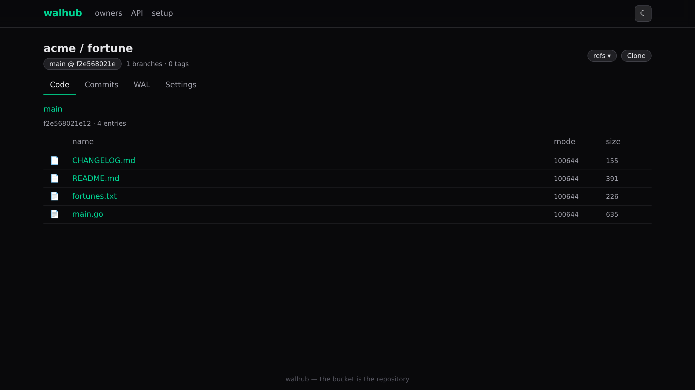
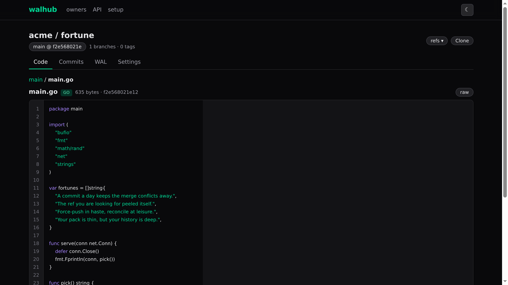
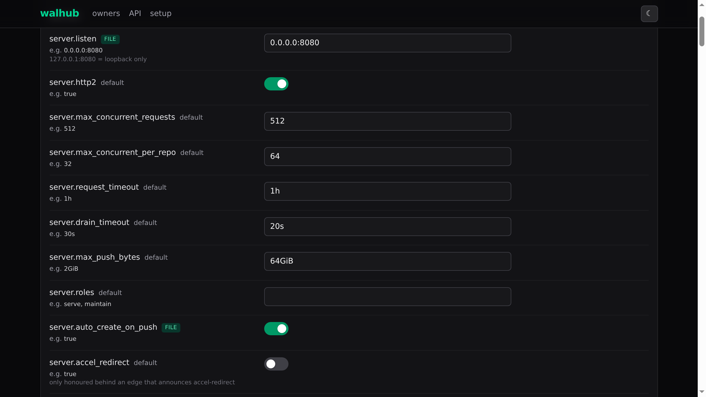

# walhub

A git host in Go: **git over smart HTTP (v0/v2), LFS, bundle-uri, a JSON API with SSE, and a web UI — where the object store is the only database.**

It serves repositories whose entire state — refs, packs, config, policy, events, web UI — lives as
objects in a bucket (filesystem, S3, or GCS). Instances are disposable; wipe one and you lose nothing
but warmth.

<p align="center">
  <a href="docs/img/repo-overview.png"></a>
  <a href="docs/img/code-view.png"></a>
  <a href="docs/img/setup.png"></a>
</p>

<p align="center"><sub>Browse repositories, read code, configure everything. Click any screenshot to view it full size.</sub></p>

## Inspired by walgit

walhub exists because of **Tobi Lütke's fantastic [walgit](https://github.com/tobi/walgit)**. It
proved that a git host can put everything on an object store, and it is the direct inspiration for
this project. Thank you, Tobi.

We aim to stay **object-protocol compliant** with walgit: the bucket key layout, the protobuf wire
encoding, and git wire behavior all follow walgit's formats. The visual direction is our own, and
as the screenshots above show, it looks quite different.

## Quick start

```sh
make build          # bundles the SDK (esbuild) and compiles the binary — web/ is embedded
./walhub            # zero-config: 0.0.0.0:8080, filesystem store, auth "none" (loud warning)
```

Then open **http://localhost:8080** — the SPA renders, `/setup` configures everything for real use.
No config file exists yet, so the first run is deliberately friction-free; save one from `/setup` and
restart. An invalid config file puts the server in **setup-only mode** (everything but setup/health
answers 503) until you fix it through the same UI.

Push something — repositories auto-create on push by default:

```sh
mkdir demo && cd demo && git init -b main
echo "# demo" > README.md && git add -A && git commit -m "hi"
git remote add origin http://localhost:8080/you/demo.git
git push -u origin main          # browse it at http://localhost:8080/you/demo
```

Auth: `none` (everyone anonymous — dev only), `token` (static bearer/basic tokens), or `oidc`
(any OpenID Connect issuer, plus walgit-issued `wgt_` access tokens minted in the UI).

## Run with docker compose (prebuilt image)

GitHub Actions publishes the image on every push to [`ghcr.io/crueber/walhub`](https://github.com/crueber/walhub/pkgs/container/walhub)
— pull it instead of building:

```yaml
# docker-compose.yml — walhub alone: filesystem store on a named volume
services:
  walhub:
    image: ghcr.io/crueber/walhub:latest   # :main tracks main; vX.Y.Z releases; sha-<sha> per commit
    ports:
      - "8080:8080"
      - "2222:2222"                        # git over SSH (17_ssh.md)
    environment:
      WALHUB__SERVER__SSH__LISTEN: 0.0.0.0:2222
    volumes:
      - walhub-data:/var/lib/walhub
    restart: unless-stopped

volumes:
  walhub-data:
```

```sh
docker compose up -d        # update later with: docker compose pull && docker compose up -d
```

Then open **http://localhost:8080/setup** — the same zero-config first boot as the binary: save a
config from the setup page and restart the container. Repositories auto-create on push under
`http://localhost:8080/<owner>/<repo>.git`.

Git also works over **SSH**: the stack publishes port 2222 and enables the SSH transport
(`WALHUB__SERVER__SSH__LISTEN`). Add your public key on the **/keys** page, then:

```sh
git clone ssh://git@localhost:2222/<owner>/<repo>.git
```

The host key auto-generates into the data volume, so it is stable across container restarts.

For an **S3-backed store** (rustfs/MinIO/GCS), see [`compose.yaml`](compose.yaml) — the shipped
stack builds from source; to run it from the published image instead, replace the `walhub`
service's `build: .` with `image: ghcr.io/crueber/walhub:latest` (the rustfs service and the
`WALHUB__STORE__*` env stay as they are). [`compose.standalone.yml`](compose.standalone.yml) is
the same standalone shape as above, built from source instead of pulled.

## What's in the box

| Area | Where | Notes |
|---|---|---|
| Object store | `internal/store` | One `ObjectStore` contract (CAS, conditional GET, compose, leases): filesystem, S3 (hand-rolled SigV4), GCS (JSON API), memory; protobuf wire codec with golden fixtures |
| WAL engine | `internal/wal` | The manifest CAS is the only commit point; sync levels, checkpoints, replay, group commit, remote reader, tasks |
| Git layer | `internal/git` | `git` is a subprocess, always: ingest, receive/upload-pack, pkt-line, repack, bundles, repair |
| HTTP | `internal/server` | chi router, hand-rolled middleware (CORS, h2c, compress), auth (none/token/oidc + hand-rolled JWKS), static serving, setup UI |
| API | `internal/api` | Repo-scoped JSON + SSE envelope, two lanes (bearer / browser), `repos.js` SDK |
| Subsystems | `internal/{bundle,events,maintain,policy,setup,config}` | bundle-uri scheduler, webhook bridge, maintainer loop, push policy rule language, bootstrap, config |
| Frontend | `web/` | SolidJS SPA + Tailwind v4 (CSS-first) and a dependency-free `repos.js` SDK; vite + esbuild build both into `web/dist/` for embedding |

## Development

```sh
make ci        # vet + fast tests + race + ≥95% coverage per package — the merge gate
make contract  # store contract suite (memory + filesystem; S3 via `make dev-store`)
make e2e       # real-git end-to-end flows
make test-web  # node --test over the headless JS modules
make image     # OCI image
```

Backend: Go 1.27 (module `git.packden.us/crueber/walhub`), exactly three third-party modules
(chi, BurntSushi/toml, x/net). Frontend: any Node for tests; pnpm 11 for the vite/esbuild build
(`pnpm --dir web install`). CI is Woodpecker on the Forgejo origin (`pipeline.yaml`); GitHub
Actions (`.github/workflows/docker.yml`) tests the mirror and publishes the image to GHCR on
every push. The container build is `Dockerfile`, with compose examples in
`compose.standalone.yml` (filesystem store) and `compose.yaml` (S3-backed via rustfs).

## License

[MIT](LICENSE) © Christopher Rueber
