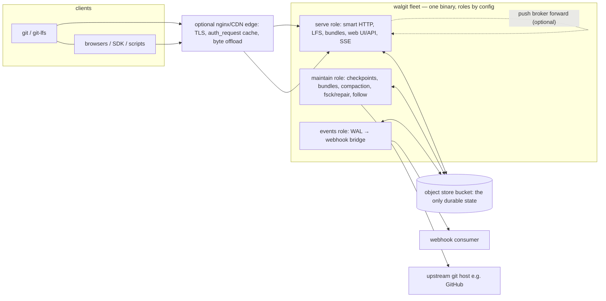

# walgit — Master Specification

**Purpose of this document:** a complete, self-contained description of walgit — every feature, every
capability, every interface, every algorithm and invariant — sufficient to **reimplement the entire system in
Go (or any language) without reading the Rust code**. It consolidates the normative design docs (`GOAL.md`,
`AGENTS.md`, `docs/BUNDLE_URI_DESIGN.md`, `docs/ROUNDTRIPS.md`, `docs/POLICY.md`, `docs/LFS.md`,
`docs/INTEGRITY.md`, `docs/EVENTS.md`, `docs/CONTRACT.md`, `web/API.md`, `walgit.example.toml`,
`deploy/nginx.conf.example`) and the code-level facts extracted from `crates/*` and `web/*` (file:line-grounded,
2026-08-31). Where this document and the code disagree, the code is right; known divergences are listed in
§20.

Conventions: **MUST** = required behavior; config keys are written `section.key` exactly as they appear in
`walgit.toml`; bucket keys are repo-relative unless prefixed "bucket root". "Manifest" always means
`repos/<owner>/<repo>/manifest.pb`, the CAS'd linearization point.

---

## Table of contents

| § | Topic |
|---|---|
| 1 | Product definition, goals, acceptance, non-goals |
| 2 | The ten principles (what a rewrite is judged against) |
| 3 | System architecture (components, roles, placement, routing, edge, broker, consistency) |
| 4 | Object store layer (interface, semantics, backends, leases, cost model) |
| 5 | Bucket data model (key layout, protobuf schema, log framing, JSON files) |
| 6 | The WAL engine (sync levels, publish, checkpoints, replay, remote reader, tasks, eviction) |
| 7 | Git layer (ingest, refs, advertisements, receive-pack, upload-pack, repack, commit-graph, bundles) |
| 8 | HTTP server (middleware, route inventory, caching, smart HTTP, LFS, auth, setup, startup) |
| 9 | JSON API, SSE envelope, tasks (the wire contract) |
| 10 | Web UI and the `repos.js` SDK |
| 11 | Bundle subsystem (slots, chains, builds, lists, forcing) |
| 12 | Events bridge (WAL → webhook) |
| 13 | Maintenance (maintainer loop, compaction, base rebuild, fsck/repair, upstream follow) |
| 14 | Push policy (the per-repo rule language) |
| 15 | Configuration reference (every key, default, validation) |
| 16 | CLI reference |
| 17 | Testing strategy (tiers, simulation, contract tests) |
| 18 | Packaging and deployment (binary, TLS, container, nginx edge, compose) |
| 19 | Porting notes for a Go implementation |
| 20 | Code-vs-docs discrepancies observed (do not copy blindly) |
| 21 | Glossary |

---

## 1. Product definition

### 1.1 The one sentence

**A share-nothing git host, fast for monorepos, with an object store as the *only* source of truth — one
binary anyone can run against a bucket, predictable enough that tooling can build on it.**

### 1.2 What it is

walgit serves git over smart HTTP (protocol v0 and v2) plus bundle-uri, LFS, a browsing web UI and a JSON API
with a dependency-free SDK. Durable state is **only** an object-store bucket (S3-compatible or GCS). Every
process instance is a disposable cache: wipe all instances and you lose warmth, nothing else. There is no
database, no queue, no Redis, no node identity, no leader election, no gossip. Coordination happens only
through bucket primitives: compare-and-swap on one tiny manifest object, content-addressed immutable objects,
and CAS+TTL leases.

It is an implementation of the architecture Cursor described in *Git at any scale* (their system
"Continuity"), changed where necessary to run on machines **smaller than the repository** (a few vCPU, tens of
GiB of RAM, disk = that memory, i.e. tmpfs). Additions over the source design: the **remote reader** (serve a
repository whose packs can never fit the instance, over HTTP range requests), the **history pack** (commits +
trees local, blobs in the base pack), and **bundle-uri** as the clone path (fresh clones and catch-ups are
static bucket files; upload-pack only ever answers the small remainder).

### 1.3 Feature surface (the complete list)

| Area | Capabilities |
|---|---|
| git smart HTTP | v0 and v2 (`ls-refs` with prefixes/symrefs/peel/unborn; `fetch` with want/have, `filter`, `shallow`/`deepen`/`deepen-since`/`deepen-not`, `want-ref`, `sideband-all`, `no-progress`, `include-tag`, `wait-for-done`), `receive-pack` (create/delete/update refs, force detection, atomic, deletes, tags incl. peeled, push options, report-status, side-band-64k), `<owner>/<repo>[.git]` namespaces, sha1 and sha256 repositories, gzip request bodies, `object-info`-less (not implemented) |
| bundle-uri | v2 capability + `bundle-uri` command, static lists `bundles/list` (clones) and `bundles/catchup` (fetch recipes), per-strategy bundle objects with ETag/Range/immutable, calendar-slot scheduling with backfill, chained incrementals, blobless (`blob:none`) family on a filtered list, optional presigned store URLs, `bundles.require` refusal of unbounded zero-have clones with the exact fix in the error |
| LFS | Batch API (`operation=upload\|download`, transfer `basic`), basic transfer GET/HEAD/PUT + `verify`, sha256-addressed objects in the bucket, size+sha256 verification, `max_object_bytes` cap, optional read-through from an upstream LFS server (stream + persist), presigned or proxied serving |
| web UI | React SPA: owners/repos pages, GitHub-shaped tree/blob/commits/commit pages, README rendering, markdown preview, syntax-highlighted blobs, unified/split diffs, branch/tag picker (SSE), clone menu with setup recipes, WAL health dashboard (manifest, packs, bundle chain + plan, compactions, segments, ops), tasks overlay, settings tab (scheduled tasks, push policy editor + validate + dry-run, effective config editor + history + revert) |
| JSON API | Repository-scoped read API (`refs`, `refs/{branches\|tags}` paged/streamed, `resolve`, `tree`, `blob`, `commits`, `commit`), repo summary/create/delete, per-repo settings (get/put/delete/effective/history/describe/validate), policy (get/put/delete/validate/dry-run), overview (WAL health), tasks + attachable SSE streams, ops (maintenance actions), owner listing, discovery document, `me`; two lanes (bearer/same-origin and cross-origin browser) |
| SDK | `repos.js` (IIFE → `window.repos`) + `repos.mjs` (ESM), dependency-free, maps the whole API, picks the lane, performs the popup auth flow, unwraps the SSE envelope |
| auth | `none` (loopback only, everyone anon+write+admin), `token` (static tokens as Bearer or Basic password), `oidc` (any OpenID Connect issuer: browser sign-in, verified ID tokens as bearers, walgit-issued `wgt_` access tokens minted at `/_auth/tokens`, static tokens for robots); admin flags independent of write; trusted-forwarder identity forwarding; real 401 semantics so git erases dead credentials |
| policy | Per-repo `policy.json` rule language: groups, ordered rules, ref/principal/path match, `protect` (AND-combined, enforced), `history`/`size` (parsed, not enforced), named-rule rejections on the wire |
| settings | Per-repo TOML overrides (`[bundles]`, `[maintenance]`, `[compaction]`, `[upstream]`, `[integrations]`, ≤ 16 KiB) published **into the WAL** (inline on the manifest + SETTINGS log entries with history) |
| events | A bridge (its own role) tails the WAL from a durable cursor and POSTs `ref` events (create/update/delete) to a webhook, at-least-once per batch, dedup key `(repo, seq, ref_name)`, HMAC signature, bucket-notification wake-up + periodic sweep |
| maintenance | One self-healing loop per maintainer: checkpoints, object repair from upstream, weekly full bundle (base rebuild on SSD hosts, then bucket-side compose), chained dailies/hourlies, geometric compaction, rev-index retrofit, periodic connectivity audit (`fsck`); placement-driven assignment; resumable base rebuilds and imports |
| CLI | `serve`, `compact`, `bundle run/plan/compose/rm`, `repo create/list/info/policy/settings`, `wal ls/show/materialize/add-pack/annotate-pack/rev-index`, `synth`, `import` (two modes, resumable), `mirror`, `config check/dump`; `walgit-server` = `walgit serve` |
| stores | S3 + S3-compatible (AWS, MinIO, rustfs, R2, Ceph), GCS (gRPC + JSON API hybrid), in-memory (tests) — one contract suite runs against all |
| ops | `/healthz`, `/readyz` (prewarm/drain aware), Prometheus `/metrics`, structured logs (pretty/JSON) with request ids and trace correlation, lock-wait instrumentation, runtime watchdog, graceful two-phase drain |

Explicitly **not** in scope: code review, merge queues, CI, issues, fork networks, PRs. (Commit-trailer
conventions exist so external merge-queue tools can integrate; walgit only renders trailers.)

### 1.4 Acceptance bars (what "done" means)

| Claim | Bar |
|---|---|
| Cold instance useful in seconds | `ls-remote` of the largest repo < 1 s on a fresh instance, even while its packs install |
| CI clone of a 57 GiB / 73 M-object / 466 k-ref monorepo | `clone --filter=blob:none --depth=1 --sparse --single-branch -c transfer.bundleURI=false` in seconds (reference: 2075 s → 8 s) |
| Developer catch-up | a days-stale `fetch` on main = exactly the missed bundle slots + < 1 h of objects from upload-pack |
| Fresh clone | bytes through the server ≈ one hour of pushes (reference: 32.7 GB static, 2.8 MB through upload-pack) |
| Web UI on the monorepo | tree/blob/commits render without packs on disk, ~100–200 ms warm |
| Push | acknowledged only after the bucket ACKs; one CAS per batch; the maintaining host writes |
| Consistency | push then fetch anywhere sees it; concurrent pushers: exactly one winner (simulation suite proves) |
| Security | every route authenticated in token/oidc mode; fail-closed config; dead credential ⇒ real 401 |
| Data completeness | every object reachable from an advertised ref is in a live pack; weekly fsck + repair keep it so |

### 1.5 Non-goals

- Millions of tiny repositories (the long tail is served, not tuned for).
- A 30 GB base repack on a tmpfs host (that is the SSD host's weekly job).
- Forking git or inventing an object format; all weirdness happens *around* git.

---

## 2. The ten principles

A rewrite MUST preserve these; every design decision above answers to them.

1. **No state outside the object store.** Disk and memory are caches. If every instance is wiped, what is
   lost must be "warmth". (No local queues, flag files, or env-encoded data.)
2. **The manifest CAS is the only commit point.** Immutable objects are never overwritten (`PutMode::Create`
   for content-addressed objects). The only overwritable objects: `manifest.pb`, `bundles/list.pb`,
   `leases/*`, bucket-root `maintain/<host>.pb`, `events/cursor.json`, `policy.json`, `fsck.pb`, render
   cache. Nothing is visible before the manifest CAS; everything after it is idempotent and replayable.
3. **Side effects are readers of the WAL, never steps of a write.** Events, mirrors, notifications tail the
   log from a durable cursor. A webhook failure must never fail a push.
4. **Every read revalidates; there is no "eventually".** Each request starts with a conditional GET of the
   manifest (skippable only within `wal.freshness_ttl`). Push acknowledged ⇒ the next request anywhere sees it.
5. **Serve from the parts that fit; never a bigger box, never a hard-coded host.** No hostname may appear in
   application code; placement is configuration.
6. **Never block the async runtime; bulk bytes never share a lane with the control plane.** Blocking git/fs
   work runs on a separate pool; pack bytes use dedicated transports/permits. (§4.6, §6.1 — this is a hard,
   incident-proven rule.)
7. **No LIST on a hot path; count the round trips.** Probe (404s are free), don't list. Every protocol change
   is judged on sequential bucket round trips (§4.8).
8. **Standalone first; the edge announces, the app never assumes.** The full product works with nothing in
   front. Any capability an edge takes over is announced per request in `X-Walgit-Capabilities`.
9. **No silent waiting.** Long work is a task with an id, a log and a progress stream, narrated to git
   (sideband 2) and browsers (SSE).
10. **Keep it small; upstream git does git things.** Stock `git` binary for repack/bitmaps/bundle
    creation/upload-pack wherever it can read the packs; in-process git engines only where measured and
    correct (the remote-served-base fetch); protobuf is append-only.

---

## 3. System architecture

### 3.1 Components



- **One binary**, `walgit` / `walgit-server` (identical serve path), roles by config: `server.roles = ["serve",
  "maintain", "events"]`; empty = all three (one-box shape). Any number of `serve` instances may point at one
  bucket. Per repo, exactly one maintainer (placement globs) performs object work and writes; other hosts
  still serve refs-level reads.
- **The bucket is the repository.** Layout under `repos/<owner>/<repo>/`: `manifest.pb` (CAS'd),
  `log/<seq>.pb` segments, `wal/<checksum>.pack|.idx|.rev|.bitmap|.commit-graph`, `checkpoints/<seq>/`,
  `bundles/`, `leases/`, `policy.json`, `lfs/objects/`, `events/cursor.json`, `fsck.pb`, `cache/api/v1/`.
  Plus bucket-root `maintain/<host>.pb` heartbeats. (§5 for the complete schema.)
- **Write path (push):** our receive-pack indexes the incoming pack locally (`git index-pack` in a scratch
  git-dir), checks connectivity, evaluates push policy, uploads `pack ∥ idx ∥ log entry` to the bucket, then
  CASes the manifest (group-committed per repo per instance). Client sees `ok` only after the bucket ACKs.
  On CAS loss: re-read, re-validate every old value, retry with jittered backoff.
- **Read path:** one conditional GET of `manifest.pb` per request → 304 serve local / 200 apply the tail.
  What "apply" means depends on the request's **sync level** (§6.2): refs only; refs + packs-that-fit; full
  materialization; or objects via the remote reader.
- **Placement is configuration** (`[placement] serve/serve_exclude/maintain/maintain_exclude` globs). A host
  that does not *serve* a repo answers object work (upload-pack, receive-pack, LFS transfer, prefetch) with
  **503 + `Retry-After: 15`** and a pkt-line `ERR walgit: <repo> is served by <host>; retry shortly` **before
  any sync**; refs-level reads (info/refs, ls-refs, API refs/resolve/overview, UI, bundle lists) stay
  available everywhere. Routing to hosts is by repo prefix only (`/<owner>/<repo>` — git, bundles, LFS, API,
  UI all live under it).
- **Push broker (optional):** a host that maintains nothing may forward receive-pack bodies to a
  single-writer broker (`wal.push_broker_url` + `wal.push_broker_token`; the broker lists the token in
  `server.auth.tokens` and its principal in `server.auth.trusted_forwarders`; end-user identity travels in
  `X-Walgit-Principal`). Fallback to local publish if the broker is down (the buffered body is replayable up
  to `wal.push_broker_buffer_bytes`). Publish is CAS-safe, so the broker is an optimization, never a
  dependency.
- **Edge (optional):** TLS, one cached `auth_request` verdict per credential, repo-prefix routing, and byte
  offload via `X-Accel-Redirect` — only when the edge announces `X-Walgit-Capabilities: accel-redirect,
  client-authorization` per request and walgit answers `X-Walgit-Store-Url/-Authorization/-Key` (§8.6). An
  edge's fallback for a placed repo is read-only and refs-level (D29): git RPC and LFS writes have no
  fallback.

### 3.2 Consistency model

- The manifest is a single object with CAS (`PutMode::Update(version)` / `Create`); its `revision` field is a
  monotonic counter of successful writes. A 412 is the normal contention signal: re-sync, re-verify, retry.
- Non-412 store errors during the manifest CAS are **ambiguous** (the write may have landed and the response
  lost): the writer re-reads the manifest fresh ("cas_landed") and treats "my log segment is listed" as
  committed. A written-but-uncommitted log segment (orphan) is harmless: later writers burn past its seq
  (§6.4), and it is swept after a later commit.
- Readers guard against a stale manifest read *after* their own local publish: a manifest older than the one
  held in memory is ignored (monotonic revision guard).
- Local application of a committed ref transaction happens **after** the CAS, under the refs lock, and the
  new manifest version is advertised only after the local refs are written; if local application fails the
  version advertisement is withdrawn so the next sync replays — but the push is still answered `ok`, because
  the bucket CAS is the truth.

### 3.3 The machine model

- Instance = a few vCPU, tens of GiB RAM, disk ≈ RAM (tmpfs), CPU may be throttled between requests.
  `cache.max_bytes` (default 20 GiB) is the budget for everything on disk in **budget** mode.
- Object store facts (GCS-class): GET/PUT small object 60–80 ms; conditional GET → 304 ≈ 15 ms; 404 free;
  LIST slow/paged (never hot path); CAS overwrite serialized ~1 write/s per object; range read ~100 MB/s per
  connection (stripe for more); compose = 1 request, ≤ 32 sources.
- Operations needing real disk or hours of CPU (full `repack -adb` of a monorepo, weekly 30 GB bundle) run on
  the **SSD host** (`maintenance.disk = "ssd"`, `cache.mode` auto-resolves to `disk`) using the same binary
  and protocol.

### 3.4 Process inventory (per instance)

| Loop / component | Role | Notes |
|---|---|---|
| HTTP listener (axum-class) | serve | h2c and/or TLS (ALPN `h2`, `http/1.1`), TCP_NODELAY per connection |
| Runtime watchdog (1 s tick) | all | gauge tasks running, inflight; warns "async runtime stalled" when a tick is > 2.5 s late; `inflight = 0` at a late tick means the platform paused the process, `inflight > 0` means a real stall |
| Bulk runtime (dedicated pool, 4 workers) | serve/maintain | pack materialization only; never shares threads with request handling |
| Prewarm | serve | `cache.prewarm` repos materialized at startup, bounded parallelism (`cache.prewarm_parallelism`, default 2); `/readyz` 503 until done or `cache.prewarm_ready_timeout` |
| Maintainer loop | maintain | every `maintenance.interval` (60 s): heartbeat, then one bounded unit per assigned repo (§13.1) |
| Upstream-follow loop | maintain | every `maintenance.follow_interval` (30 s): keep `upstream.follow` refs equal to `upstream.git` (§13.5) |
| Events bridge | events | wake-ups from `POST /_events/notify` + sweep every `events.sweep_interval` (§12) |
| Compaction loop / bundle loop (legacy role shapes `compact`/`bundle` without `maintain`) | — | when `maintain` is absent but `compact`/`bundle` role present: 60 s passes calling the respective ops (kept for role decomposition) |
| Drain (SIGTERM) | all | phase 1: stop starting maintenance units, interrupt the running unit at once, serving + `/readyz` stay up, bounded 30 s; phase 2: `/readyz` 503 + `Retry-After`, new fetch/push/LFS refused 503, in-flight requests capped at `server.drain_timeout`, exit |

Instance identity: `WALGIT_INSTANCE_NAME`/`WALGIT_INSTANCE_ID` → `name/id`; else `HOSTNAME/pid`; else UUID.
Appears as lease holder, manifest `writer`, task `hostname`, heartbeat `host`, and the `Server` header
(`walgit/<version> (<kind>; <name>[/<instance>])`, kind = `serverless|ssd|dev`).


### 3.5 Lineage: Continuity (Cursor, *Git at any scale*), and exactly where walgit deviates

walgit is an implementation of the architecture Cursor describes in *Git at any scale* (their system
"Continuity"; the post is kept verbatim at `docs/reference/cursor-git-at-any-scale.md`). A rewrite should
understand both the inherited design and the deltas.

**What the post establishes (the parts walgit keeps as-is):**

- *Why packfiles make hosting hard*: repository data is a DAG; every git operation is a random walk over
  gigabytes of delta-compressed packs whose physical layout has no correlation with the logical graph.
  Networked filesystems (NFS, GFS/DRBD block replication) fail on this; object-level DHT storage fails on
  round trips (one hop per pointer). Hence: keep real git repositories on fast local disks and never put
  the pack bytes on a network filesystem.
- *Spokes' three good choices* (walgit inherits all three): (1) don't distribute git itself — work at the
  packfile level; (2) store data as actual git repositories on local NVMe so upstream git does the work;
  (3) keep all copies **consistently** in sync — git clients and CI break on eventual consistency.
- *Spokes' flaws* (walgit is designed against them): three-phase-commit consensus bounds push throughput by
  the slowest replica and forces ≥ 3 replicas per repository (the floor is too high for millions of tiny
  agent-created repos, the ceiling too low for a monorepo's CI); and because on-disk copies are the source
  of truth, repositories are pets — an external routing table maps every repo to its machines, and every
  copy must be checksummed, monitored, and repaired quickly.
- *Continuity's core*: a **write-ahead log in object storage is the source of truth**. A push = an immutable
  WAL entry (packfile + ref transaction) that is **never acknowledged before it is fully persisted**;
  visibility happens only when a tiny index object is updated with an **atomic compare-and-swap — the CAS
  is the consensus**. Any server can be the primary; a losing pusher refetches and retries (exactly one
  winner). Local copies are warm caches, materialized from the WAL when missing; there is no routing table,
  no elections, no relational database. Reads are consistent because every replica verifies against the
  source of truth (conditional GET on the index; a 304 costs ~15 ms). **Compaction is amortized**: only the
  primary repacks, and the result is *published into the WAL* — replicas never repack, they download the
  compacted packs (trading bandwidth for CPU). The WAL is full provenance: every push and every compaction
  is an entry, replayable to any point. Result: reads scale linearly with replicas (measured to 100), and
  push throughput is bounded only by the store's CAS latency (Cursor: 120 pushes/s on S3 Standard, 300+ on
  S3 Express One Zone; walgit's group commit + push broker exist to push against the same cap).

**Where walgit deviates (each is a decision in force, not an accident):**

1. **No gossip.** Continuity gossips UDP hints so replicas can skip the conditional GET after a push; walgit
   has **no node-to-node networking at all** (share-nothing, no node identity). Every read revalidates via
   one conditional GET of the manifest — correctness never depends on a lost datagram, and the 304 path is
   cheap enough.
2. **Placement is configured, not rendezvous-hashed.** Continuity ranks hosts by rendezvous hashing and
   prefers the first as primary; walgit makes assignment explicit `[placement] serve/maintain` globs (D30)
   because the deployment shape (one big SSD host + many small tmpfs hosts) is a human decision, and an
   edge must be able to route by repo prefix deterministically. A push broker (D28) plays the
   "preferred primary" role as an optimization, with CAS-safety as the correctness backstop.
3. **The manifest is richer than a WAL pointer.** Where Continuity's index is "a pointer to the WAL entry",
   walgit's manifest carries the denormalized live pack set, the checkpoint pointer, log segment inventory,
   per-repo settings inline, and a revision counter — so a refs-level sync needs exactly one GET to know
   *what* to fetch (round-trip rule: carry state in the object you already fetch).
4. **Checkpoints fold the log.** The post notes a full restore replays every entry; walgit adds explicit
   CHECKPOINT entries (ref snapshot + pack inventory at a seq) so cold start = snapshot + tail, never full
   replay, and old log segments are GC'd behind `min_seq`.
5. **Serving machines smaller than the repository** — the reason walgit exists as a separate implementation:
   - **Remote reader**: web UI/API on a repo whose packs can never fit the instance (objects faulted by
     1 MiB range reads through the manifest's pack indexes).
   - **History pack (D18)**: commits + trees kept local next to a bitmap'd base so history walks (log,
     blame, tree diffs, the gix engine) never touch blob bytes.
   - **Bundle-uri as the clone path**: the post keeps clone bytes going through upload-pack; walgit moves
     them to static bucket files (weekly full composed from the base, chained dailies/hourlies,
     `creationToken` slots) so "fresh clone" costs the server one negotiation of < 1 h of pushes.
6. **Leases for cross-instance exclusivity.** Continuity needs none for pushes (CAS is enough); walgit adds
   CAS+TTL leases for *maintenance* work (compaction, bundle builds) where two workers would duplicate
   hours of CPU, not race a pointer.
7. **Receive-pack is ours.** Continuity's push path is unspecified at the protocol level; walgit implements
   receive-pack itself (index-pack in a scratch dir, connectivity, policy, report-status) so pushes become
   WAL entries + group-committed CAS batches rather than a local ref update with replication.

Everything else — the CAS commit point, WAL entries as immutable objects, cache-not-truth local copies,
linearizable pushes, provenance — is inherited and MUST survive a rewrite.

---

## 4. Object store layer

### 4.1 The interface (must be implemented exactly once, backends behind it)

```
Version            opaque CAS token (string). GCS = object generation (decimal string);
                   S3/rustfs = ETag with quotes stripped; memory = global counter.
                   Callers compare for equality only; never parse.
AccelTarget        { url, authorization? } — what a trusted edge uses to fetch one object.
ObjectMeta         { key, size (whole object even for range reads), version }
GetOptions         { if_none_match?: Version  → 304-style NotModified when equal
                     if_match?: Version       → PreconditionFailed when different
                     range?: [start,end) half-open }
GetResult          NotModified{version} | Object{meta, body stream}
PutMode            Overwrite (default) | Create (only if absent) | Update(version) (CAS)
PutOptions         { mode, content_type?, immutable? }  // immutable ⇒ long cache headers
PutBody            Bytes | Stream{len (KNOWN length required), stream} | File(path)
StoreError         NotFound{key} | PreconditionFailed{key, current?} | Retryable(err)
                   | InvalidArgument(msg) | Other(err)
ObjectStore:
  backend() -> "gcs"|"s3"|"memory"
  get(key, opts) / head(key) -> Option<ObjectMeta> / put(key, body, opts) -> ObjectMeta
  delete(key, if_version?) — CAS delete; unconditional delete of absent = Ok
  list(prefix, start_after?) -> lazy stream of ObjectMeta, lexicographic, strictly after
  list_prefixes(prefix) -> distinct "<prefix><segment>/" (delimiter listing), sorted
  signed_get_url(key, ttl) -> Option<url>     // presigned direct download
  accel_target(key) -> Option<AccelTarget>    // edge offload (§8.6)
  supports_compose() -> bool / compose_is_native() -> bool
  compose(dest, sources[], opts) -> ObjectMeta  // server-side concat, 1..=32 sources, in order
Extensions: get_bytes, get_if_changed(key, known), put_bytes, exists
```

All keys are prefixed by `store.prefix` (a `Prefixed` wrapper; prefix normalized with trailing `/`).
`PreconditionFailed` is protocol-normal (CAS contention), never an error outcome in telemetry.

### 4.2 Store key classification: control plane vs bulk

- **Control plane** (small, must never queue behind bulk bytes): every key whose last path segment ends
  `.pb` or `.json` (manifest, log, checkpoints, leases, bundle list, policy, cursor, fsck, render cache).
- **Bulk** (pack/idx/side-file/bundle/LFS bytes + every ranged read): keys under `wal/`, `bundles/`, `lfs/`.
  On GCS these use dedicated transports and a global permit pool (§4.6).

### 4.3 Backend: GCS

- Version = decimal generation string. Conditional GET via `if_generation_not_match`; conditional PUT via
  `if_generation_match` (0 = create-if-absent). 304 and `FailedPrecondition` both mean "not modified";
  `FailedPrecondition`/412 mean precondition failure.
- **Topology:** one control-plane gRPC `Storage` client + a `StorageControl` client (metadata ops) + N bulk
  clients (`store.gcs.bulk_clients`, default 4, round-robin, own gRPC channels) + N HTTP/1.1 clients for
  **bulk reads** over the JSON API (`alt=media` + `Range`) — because all gRPC clients share one transport and
  a 200-byte GET queued seconds behind 32 range stripes. `store.gcs.bulk_concurrency` (default 32) = global
  semaphore gating ALL bulk requests (gRPC and HTTP), with queue-time metrics and a WARN past
  `telemetry.lock_wait_warn`.
- **Deadlines:** metadata ops 10 s (retry once, jitter 100–500 ms); read open 60 s; read chunk 60 s; PUT =
  30 s + bytes/1 MiB s; single-shot PUT limit 8 MiB (larger File/Stream bodies go resumable/buffered in
  256 KiB chunks); list page 1000.
- **Bulk read resume:** a mid-stream failure re-issues the request for the undelivered suffix pinned to the
  same generation (`ifGenerationMatch`), up to 5 attempts with exponential backoff — a rewritten object can
  never be spliced.
- **compose is native** (`compose_is_native = true`): `ComposeObject`, 1..=32 sources, ≤ 30 s, sources left
  in place; honors Create/Update/Overwrite on the destination.
- `accel_target`: path-style URL `https://storage.googleapis.com/<bucket>/<encoded-key>` +
  the process's **own bearer token** as `authorization` (the edge cannot refresh tokens).
- `signed_get_url`: IAM signBlob (V4) for GET with TTL; requires `store.gcs.signing_service_account` or ADC
  with signing rights; failure → None (callers fall back to proxy).
- Error mapping: 404/NotFound → NotFound; 5xx/429/Unavailable/DeadlineExceeded/ResourceExhausted/Internal/
  Aborted → Retryable; 304/FailedPrecondition(not-modified) → NotModified; FailedPrecondition/412/416 →
  PreconditionFailed.
- Quirk: a CAS PUT (`Update`) with an unparseable version string silently skips the precondition (write
  path); the read/delete paths return `PreconditionFailed` instead.

### 4.4 Backend: S3 (and all S3-compatible stores)

- Static credentials from env var *names* in `store.s3.access_key_env`/`secret_key_env` (defaults
  `AWS_ACCESS_KEY_ID`/`AWS_SECRET_ACCESS_KEY`; `AWS_SESSION_TOKEN` honored), region, endpoint, and
  `force_path_style` (true for rustfs/MinIO).
- **Reads** are presigned GETs (60 s expiry) sent through an HTTP client so conditional headers and ranges
  can be attached: `If-None-Match` (if_none_match), `If-Match` (if_match), `Range: bytes=start-end`
  (inclusive on the wire). 200/206 → Object (ETag = version); 304 → NotModified; 404 → NotFound; 412 →
  PreconditionFailed; 5xx/429 → Retryable.
- **Writes:** single-shot `PutObject` with `If-None-Match: *` (Create) or `If-Match` (Update) — **multipart is
  used only when `len > store.multipart_threshold` (default 64 MiB) AND mode == Overwrite** (S3 multipart has
  no conditional headers). Multipart: CreateMultipartUpload → parts of `store.multipart_part_size` (32 MiB) →
  Complete; abort on any failure. On PreconditionFailed, `current` is filled by a follow-up HEAD.
- **Delete:** S3 has no conditional delete — emulated: HEAD first when `if_version` given (absent →
  NotFound; mismatch → PreconditionFailed), then unconditional delete (check-then-act race accepted; all
  mutation of the same key is lease-guarded by protocol). Unconditional delete of absent → Ok.
- **compose**: `supports_compose = true`, `compose_is_native = false` — implemented as a multipart upload
  whose parts are `UploadPartCopy` byte ranges of the sources (copy chunk 1 GiB, min part 5 MiB; small
  sources/tails are read via ranged GET and uploaded as parts). Create → HEAD dest first (non-atomic
  pre-check). Because it moves bytes inside the bucket, callers that want a parallel single-file upload use
  striped multipart PUT instead (§4.7) when `compose_is_native()` is false.
- `accel_target`: presigned GET, TTL 1 h, no authorization header (Range is not a signed header, so the edge
  may slice).
- rustfs/MinIO notes: presigned GETs honor conditional headers; ETags quoted; ListObjectsV2 paging works;
  multipart supported (no conditional headers on Create/Complete — same as real S3); DeleteObject idempotent.

### 4.5 Backend: memory (tests)

BTreeMap keyed, global monotonic version counter (unique across keys — mimics generations). Implements the
full trait incl. compose (concat under lock, honors CAS via put) and range clamping. Test knobs: artificial
per-op latency; `fake_object_urls` (accel_target returns a GCS-like url + bearer for edge tests);
`signing_fails` (signed_get_url errors like VPC-SC). The simulation suite wraps it per-instance in a
**FaultStore** (§17.3).

### 4.6 Transport discipline (the incident-proven rule)

Bulk bytes (pack/idx/side-file/bundle/LFS, ranged reads) and control-plane objects never share a transport or
a permit. On GCS: separate clients + a global `bulk_concurrency` semaphore with queue metrics
(`walgit_store_bulk_queue_seconds`, gauge inflight, WARN "lock wait" past threshold). On S3: one SDK client +
one HTTP client is acceptable, but reads still classify by key (the classification function must exist).
Rationale (recorded incidents): a `bundles/list.pb` GET sat 455–472 s behind 32 range stripes; a
control-plane GET queued 3–11 s behind a 7.5 GB download.

### 4.7 Striped upload (`put_file_parallel`) and striped download

- **Upload** (used for packs, bundles, LFS, composed artifacts): if the store cannot compose natively or the
  file is ≤ 128 MiB → single PUT. Else: part size = clamp(ceil(size/1024), 64 MiB, 1 GiB); parts uploaded
  concurrently as `<key>.part/{i:04}` (Overwrite); then compose — ≤ 32 parts in one call, else per-32 groups
  composed into `<key>.part/mid{g:04}` and one final compose of the mids (two levels; max 1024 parts). Part
  and mid keys are best-effort deleted. The destination's PutMode (Create) applies to the final object only.
- **Download of large pack files** (materialization): chunk = 32 MiB, 16 concurrent stripes per object
  (`buffer_unordered`); preallocate the file, write at offsets; a short read is a Corrupt error. A known size
  from `PackRef` skips the HEAD.

### 4.8 The round-trip cost model (normative for protocol work)

Correct is necessary, not sufficient: every protocol touching the bucket is judged on **sequential round
trips** (depth) and total requests. Budgets to defend (happy path):

| Operation | Depth | Requests |
|---|---|---|
| Any read (info/refs, ls-refs, web refs/resolve) | 1 conditional GET (0 within freshness_ttl) | 1 |
| Cold refs sync | manifest GET → (checkpoint refs ∥ tail segments) | 2 + tail (no checkpoint: 1 + tail) |
| Push / publish (per batch) | freshness GET → (pack PUTs ∥ log PUT) → manifest CAS | 5 (4 if already synced) |
| Checkpoint | freshness GET → (refs PUT ∥ checkpoint PUT) → manifest CAS | 4 |
| Settings publish | refs sync → log PUT → manifest CAS | 3 (readers pay 0) |
| Lease acquire | GET → CAS put | 2 |
| Repo listing | 0 within 30 s cache; else prefixes → (HEAD manifests ∥ owners) | 1 + owners + repos |
| Maintainer bundle pass (retention + settle) | list GET → ≤ 1 retention CAS → ≤ 1 verdict-batch CAS | ≤ 3 |

Rules of thumb: depth before count (parallelize independent PUTs); **let the conditional write be the read**
(a 412 tells you what a GET would have); verification goes on the failure path (HEAD only after a 412; fresh
manifest read only after a non-412 CAS error); carry state in the manifest so no second GET is needed;
re-use version tokens you hold; batch at the CAS (group commit; broker); never pay per ref or per pack on a
hot path; immutable answers are cached forever (process LRU → bucket `cache/api/v1` → HTTP `immutable`);
jitter every retry on a CAS'd object. Simulation asserts exact budgets (`FaultStore::stats().ops`): push ≤ 5,
warm refs = 1, cold refs w/ one tail = 2, checkpoint = 4.

### 4.9 Leases (the only cross-instance mutex)

Object: protobuf `Lease{holder, purpose, acquired_at, expires_at, epoch}` at `leases/<name>.pb` (repo-scoped).

- **Acquire:** absent → `Create` (epoch 0). Present: stealable only when `now ≥ expires_at + 2 s` (clock-skew
  tolerance) → rewrite with `epoch+1` via CAS (`Update`); 412 → lost race. Not expired → None.
- **Heartbeat:** CAS-rewrite with `epoch+1`, `expires_at = now+ttl`; loss (412) = `LeaseLost` (stop work).
  A background heartbeat task runs for long holders; transient store errors are retried, loss releases.
- **Release:** CAS delete; deleting an already-stolen/absent lease is Ok. `Drop` = best-effort delete.
- **Lease names in use:** `leases/compact.pb` (compaction + base rebuild; TTL `compaction.lease_ttl`, default
  10 m; no heartbeat spawned — TTL + release), `leases/bundle-<strategy>.pb` (per-strategy bundle builds; TTL
  per strategy; NOTE the bundle variant historically lacks the 2 s skew tolerance).
- Polling acquire: jittered backoff 10–200 ms until `wait_up_to`.

### 4.10 Generic CAS helper

`cas_update<T>(key, max_retries, f)`: read (absent → `f(None)`) → `f` returns the new value (or abort) → put
Create/Update(version) → 412: re-read, retry (no sleep, counted); Retryable: backoff 5 ms→100 ms; exceed →
`RetriesExhausted`. Used by bundle list, policy, catalog; the manifest publishers implement their own inline
ladder (§6.4).

---

## 5. Bucket data model

### 5.1 Key layout (complete)

Everything repo-scoped lives under `repos/<owner>/<repo>/`. **Everything except `manifest.pb`,
`bundles/list.pb`, `leases/*` is immutable** (content-addressed or seq-addressed; written with
`PutMode::Create` + `immutable` cache headers).

| Key (repo-relative) | Kind | Written by | Meaning |
|---|---|---|---|
| `manifest.pb` | protobuf `Manifest` | publishers (CAS) | **The linearization point** |
| `log/<first_seq:016x>.pb` | framed `LogEntry` stream | publishers (Create) | Immutable log segment (regional shape); zonal variant is appendable (readers tolerate a partial trailing frame) |
| `wal/<checksum>.pack` | git packfile | publishers | Content-addressed by the pack's trailing SHA (hex) |
| `wal/<checksum>.idx` | pack index | publishers | Pair of the pack |
| `wal/<checksum>.rev` | reverse index | compaction/base rebuild/rev-index unit | Optional; ≥ 250 k objects without one is repaired |
| `wal/<checksum>.bitmap` | pack bitmap | base rebuild | Tier-2 base |
| `wal/<checksum>.commit-graph` | split commit-graph layer | base rebuild / import / commit-graph unit | Chain base for readers |
| `checkpoints/<seq:016x>/checkpoint.pb` | protobuf `Checkpoint` | checkpoint writers | Pack set + pointer |
| `checkpoints/<seq:016x>/refs.pb` | protobuf `RefSnapshot` | checkpoint writers | Full ref state at seq |
| `checkpoints/<seq:016x>/<sha>.bundle` | git bundle | import (optional) | Pre-rendered full bundle |
| `bundles/list.pb` | protobuf `BundleList` | bundle scheduler (CAS) | bundle-uri advertisement state |
| `bundles/<strategy>/<slotUTC>-<sha1-of-content>.bundle` | git bundle | bundle builds | Immutable; ETag = checksum |
| `leases/<name>.pb` | protobuf `Lease` | lease users (CAS+TTL) | `compact`, `bundle-<strategy>` |
| `policy.json` | JSON | admin API/CLI | Push policy (NOT on the WAL) |
| `lfs/objects/<aa>/<bb>/<oid>` | bytes | LFS upload / read-through | sha256-addressed (`aa`=oid[0..2], `bb`=oid[2..4]); oid must be 64 hex chars |
| `events/cursor.json` | JSON `{"published_seq": N, "updated_at": RFC3339}` | events bridge (CAS) | Durable acknowledged WAL seq |
| `fsck.pb` | protobuf `FsckReport` | fsck unit (Overwrite) | Last connectivity audit |
| `cache/api/v1/<sha1-of-cache-key>.json` | JSON | web API (Create) | Shared render cache of immutable API answers |
| bucket root `maintain/<host>.pb` | protobuf `MaintainerHeartbeat` | maintainer (Overwrite) | Who maintains what, capacity, liveness |
| bucket root `meta/repos.pb` | protobuf `RepoCatalog` | optional | Catalog (not required for correctness) |
| `<key>.part/{i:04}`, `<key>.part/mid{g:04}` | bytes | striped upload | Temp parts, deleted after compose |

### 5.2 Protobuf schema (normative; package `walgit.v1`, file `walgit/v1/wal.proto`, `WAL_FORMAT_VERSION = 1`)

```protobuf
syntax = "proto3";
package walgit.v1;
import "google/protobuf/timestamp.proto";

message Manifest {
  uint32 format_version = 1;        // 1; readers reject unknown values
  string repo = 2;                  // "<owner>/<repo>"
  string object_format = 3;         // "sha1" | "sha256"
  uint64 head_seq = 4;              // last committed entry seq (0 = empty repo)
  uint64 min_seq = 5;               // oldest entry still in log_segments; == checkpoint.seq+1 when checkpointed
  CheckpointRef checkpoint = 6;     // optional
  repeated LogSegmentRef log_segments = 7; // covers [min_seq, head_seq]; ascending, contiguous, non-overlapping
  repeated PackRef packs = 8;       // DENORMALIZED live pack set after all entries <= head_seq; sorted by seq
  google.protobuf.Timestamp updated_at = 9;
  string writer = 10;               // instance id that produced this generation
  uint64 revision = 11;             // monotonic counter of successful manifest writes (starts 1)
  RepoSettings settings = 12;       // D24: latest per-repo settings, INLINE (every refs sync sees it free)
}

message RepoSettings {            // published to the WAL; TOML restricted to allowed sections, <= 16 KiB
  string toml = 1;
  uint64 revision = 2;            // per-repo settings revision, 1 = first publish
  string author = 3;
  google.protobuf.Timestamp updated_at = 4;
  string message = 5;             // free-text reason (history)
}

message LogSegmentRef {
  string key = 1;                 // repo-relative, e.g. "log/0000000000000042.pb"
  uint64 first_seq = 2;
  uint64 last_seq = 3;
  uint64 size = 4;                // bytes at manifest-write time (appendable segments grow)
  bool sealed = 5;                // regional segments always true
}

message LogSegment { repeated LogEntry entries = 1; } // decoded form / whole-object encoding

message PackRef {
  string checksum = 1;            // pack trailing SHA, hex; key = wal/<checksum>.pack
  uint64 pack_size = 2;
  uint64 idx_size = 3;
  bool has_rev = 4;
  bool has_bitmap = 5;
  uint64 object_count = 6;
  uint64 seq = 7;                 // entry that introduced this pack
  uint32 tier = 8;                // 0 fresh push pack, 1 medium (compacted), 2 base
  bool has_commit_graph = 9;      // wal/<checksum>.commit-graph exists
  PackKind kind = 10;             // OBJECTS (default) | HISTORY
  string derived_from = 11;       // base pack checksum for HISTORY packs
}
enum PackKind { PACK_KIND_OBJECTS = 0; PACK_KIND_HISTORY = 1; }

enum EntryKind {
  ENTRY_KIND_UNSPECIFIED = 0;
  ENTRY_KIND_PUSH = 1;            // zero or one pack + a ref transaction
  ENTRY_KIND_COMPACT = 2;         // one new pack superseding `supersedes`; refs unchanged
  ENTRY_KIND_REF_UPDATE = 3;      // ref-only change (deletes, force-updates, admin ops)
  ENTRY_KIND_CHECKPOINT = 4;      // checkpoint written; packs unchanged
  ENTRY_KIND_SETTINGS = 5;        // settings changed (manifest carries latest; this is history)
}

message LogEntry {
  uint64 seq = 1;
  EntryKind kind = 2;
  PackRef pack = 3;               // PUSH (when objects pushed), COMPACT
  RefTransaction txn = 4;         // PUSH, REF_UPDATE
  repeated string supersedes = 5; // COMPACT only: checksums removed from the live set
  CheckpointRef checkpoint = 6;   // CHECKPOINT only
  google.protobuf.Timestamp created_at = 7;
  string writer = 8;
  map<string, string> meta = 9;   // provenance: principal, request_id, agent, push-options, imported_from…
  RepoSettings settings = 10;     // SETTINGS only
}

message RefUpdate {
  string name = 1;                // "refs/heads/main" or "HEAD" (symbolic update)
  string old_oid = 2;             // hex; all-zero = "does not exist"
  string new_oid = 3;             // hex; all-zero = delete
  string new_symbolic_target = 4; // HEAD symbolic target; oids then empty
  string new_peeled = 5;          // peeled commit for annotated-tag updates (replicas advertise ^{} without objects)
}

message RefTransaction {
  repeated RefUpdate updates = 1;
  repeated string push_options = 2;
  bool atomic = 3;                // recorded client intent; WAL application is ALWAYS atomic
}

message Checkpoint {              // checkpoints/<seq>/checkpoint.pb
  uint64 seq = 1;
  string object_format = 2;
  repeated PackRef packs = 3;     // pack set fully representing the repo at seq (typically 1 base)
  string refs_key = 4;            // "checkpoints/<seq>/refs.pb"
  uint64 ref_count = 5;
  string bundle_key = 6;          // optional rendered bundle
  google.protobuf.Timestamp created_at = 7;
  string writer = 8;
}

message CheckpointRef {
  uint64 seq = 1;
  string key = 2;
  google.protobuf.Timestamp created_at = 3; // drives the time trigger without a fetch
  google.protobuf.Timestamp first_state_at = 4; // earliest WAL state ever (carried forward); bundle slots before it: "unavailable"
  google.protobuf.Timestamp as_of = 5;          // created_at of newest folded entry: the state is "as of" this instant
}

message RefSnapshot {
  uint64 seq = 1;
  string object_format = 2;
  repeated Ref refs = 3;          // sorted by name, no duplicates
  string head_target = 4;         // symbolic target of HEAD
  google.protobuf.Timestamp created_at = 5;
}
message Ref { string name = 1; string oid = 2; string peeled = 3; }

message Lease {
  string holder = 1; string purpose = 2;
  google.protobuf.Timestamp acquired_at = 3;
  google.protobuf.Timestamp expires_at = 4;
  uint64 epoch = 5;               // incremented on every heartbeat/steal
}

message BundleList {              // bundles/list.pb (CAS'd, NOT immutable)
  string mode = 1;                // "all" | "any" (git bundle.mode)
  string heuristic = 2;           // "creationToken"
  repeated BundleEntry bundles = 3;
  google.protobuf.Timestamp updated_at = 4;
  repeated SkippedSlot skipped = 5; // closed slots measured and NOT cut; final per (strategy, slot, base_id)
}
message SkippedSlot {
  string strategy = 1; uint64 slot = 2; string base_id = 3;
  uint64 as_of_seq = 4;           // 0 = no state
  string reason = 5;              // "too-small: N commits (min M)" | "no state as of the slot"
  google.protobuf.Timestamp at = 6;
}

message BundleEntry {
  string id = 1;                  // stable id used in bundle.<id>.uri
  string key = 2;                 // repo-relative object key
  string strategy = 3;
  string kind = 4;                // "full" | "incremental"
  uint64 creation_token = 5;      // monotonic; = slot epoch seconds (0 for pre-slot bundles)
  uint64 seq = 6;                 // WAL seq the bundle was created from
  uint64 size = 7;
  string base_id = 8;             // bundle this incremental is based on ("" for full)
  google.protobuf.Timestamp created_at = 9;
  string version = 10;            // store version tag at upload → HTTP ETag
  repeated Ref tips = 11;         // ref tips contained; for incrementals the base's tips are the prerequisites
  uint64 slot = 12;               // calendar slot (epoch of the fire time); content is the state AS OF it
  string filter = 13;             // "" = none; "blob:none" = blobless family
}

message FsckReport {              // fsck.pb; overwritten, never replayed
  uint64 seq = 1;                 // WAL seq the audited copy had applied
  google.protobuf.Timestamp at = 2;
  string host = 3;
  repeated string missing = 4;    // bounded list
  uint64 missing_total = 5;
  uint64 problems = 6;            // count only
  double elapsed_secs = 7;
  uint64 repaired_seq = 8;        // set by repair: the seq whose COMPACT entry brought missing back
}

message RepoCatalog { repeated string repos = 1; google.protobuf.Timestamp updated_at = 2; }

message MaintainerHeartbeat {     // bucket root maintain/<host>.pb
  string host = 1;
  repeated string repos = 2;
  repeated string exclude = 3;
  uint64 max_pack_bytes = 4;
  string disk = 5;                // "tmpfs" | "ssd"
  google.protobuf.Timestamp started_at = 6;
  google.protobuf.Timestamp last_pass_at = 7;
  string last_unit = 8;           // "<repo> <kind> <detail>"
  uint64 passes = 9;
}
```

Codegen notes: all `bytes` fields map to byte-slice types; the schema is append-only (never remove/renumber
fields); proto is the wire AND the bucket format.

### 5.3 Log framing

Segment object body = repeated frames of `uvarint(len) || LogEntry`. Encoding appends; decoding stops at the
first incomplete trailing frame (left unconsumed, NOT an error — appendable segments may be read while
growing). A corrupt *complete* frame is a decode error. `LogSegment` (repeated entries) is the in-memory form
and the one-shot encoding of a sealed segment.

### 5.4 Sequence number semantics

- `head_seq` = last committed entry; entries are **strictly increasing but NOT dense**. Gaps appear when a
  writer crashed between the log PUT and the manifest CAS: after a 100 ms × 3-probe grace the seq is "burned"
  (claimed by a new writer with a fresh segment; cap 8 consecutive burns → Corrupt error). Burned segments
  are CAS-deleted only after a later commit by the same writer ("sweep"), or deliberately left in place when
  the CAS outcome was ambiguous.
- `min_seq` = oldest replayable entry (entries below are folded into the checkpoint); `min_seq =
  checkpoint.seq + 1` when a checkpoint exists.
- Log segments in the manifest cover `[min_seq, head_seq]`, ascending, contiguous, non-overlapping. An
  import publishes with `min_seq = seq + 1` (no history before the import; the checkpoint IS the origin).

---

## 6. The WAL engine

### 6.1 Registry, handles, and the lock discipline

**Registry** (one per process): store + config + cache root + a map of open `RepoHandle`s + per-repo open
single-flight + the process task table + the shared remote-reader block cache + a 30 s-cached repo listing.

- `open(id)`: fast path in map; else single-flight: GET manifest (absent → NotFound), open-or-init the local
  repo dir `<cache.dir>/<owner>/<name>.git` (init = `git init --bare` with the manifest's object format), load
  persisted state, and if `applied_seq < head_seq` apply the delta using the manifest already in hand (no
  second GET).
- `create(id, format)`: `PutMode::Create` of `Manifest{format_version:1, repo, object_format, head_seq:0,
  min_seq:0, packs:[], log_segments:[], revision:1, writer}`; 412 → AlreadyExists. Init local repo + state.
- `delete(id)`: drop the handle, **delete the manifest first** (the linearization point), then page through
  all keys under the prefix deleting, then remove the local dir.
- `list()`: cached 30 s; `list_prefixes("repos/")` → per owner `list_prefixes` → HEAD each candidate
  `manifest.pb` (parallel, bounded) — never a full object walk.
- `evict_idle()` (periodic): **budget mode** — evict least-recently-used repos (idle > `cache.evict_idle_after`)
  while Σ dir sizes > `cache.max_bytes`. **Disk mode** — statvfs on `cache.dir`; evict only when used/total >
  `cache.disk_high_watermark`, target = used − (used − (watermark−0.10)·total). Eviction takes BOTH the sync
  mutex (try-lock) and a `try_write` on the repo rw lock; if either fails, skip (never evict under readers).
  Directory size accounting: symlinks by link size; hard links counted once per (dev,ino).

**RepoHandle** per repo:

- `manifest` (last known) + its store `Version` (for CAS) + freshness timestamp.
- `sync_mutex` — serializes the refs phase (one in-flight manifest check/apply per repo).
- `pack_mutex` — serializes pack reconciliation; held WITHOUT the sync mutex so refs requests never queue
  behind multi-GB materializations.
- `rw` — protects pack removals vs readers. **CRITICAL INVARIANT:** never taken as a blocking write; only
  `try_write()` for removals (a queued writer blocks ALL new readers — a clone's read guard can live for a
  whole stream; one 24-minute clone once starved every info/refs for minutes). Readers hold a ReadGuard for
  the duration of object access; while any guard is alive no pack is removed.
- Persisted state file `walgit-state.json` in the repo dir: `{manifest_version, applied_seq, revision,
  packs_revision, pending_pack_removals[], remote_served[]}`; `packs_ready() = packs_revision == revision &&
  pending_pack_removals is empty`. Corrupt/missing → defaults.
- Progress: per-repo broadcast channel (capacity 1024) of progress packets; the active task's reporter is
  mirrored into it.
- Caches: per-manifest-revision remote reader; checkpoint times; effective-config (per settings revision).

### 6.2 Sync levels (the heart of the read path)

Every request calls a sync first. Levels:

| Level | Brings | Used by |
|---|---|---|
| **Refs** | checkpoint `RefSnapshot` + every log entry's ref txn → local `packed-refs`. No packs. | info/refs, ls-refs, bundle lists, web refs/resolve/overview, log reading |
| **Serve** (`sync()`) | Refs + the pack set *as this instance can hold it*: tiers < 2 and HISTORY packs local; a tier-2 base as side-files (idx/rev/bitmap/commit-graph) + the `.pack` **linked from a store mount** (`cache.store_mount`) or **remote-served** (no local copy); midx over history + base | upload-pack, receive-pack, bundle builds, prewarm |
| **Full** (`sync_full()`) | Refs + every live pack local (striped downloads); refused with TooLarge when the set exceeds the cache budget | base rebuilds, full repacks |
| **Objects** (`sync_objects()`) | Serve when the pack set fits the budget; else Refs + the **remote reader** → `ObjectAccess::{Local,Remote}` | web API object endpoints |

**Algorithm (per sync):**

1. **Freshness check** (unless within `wal.freshness_ttl` of the last check, default 0 = always): known
   version → conditional GET of `manifest.pb` (Unchanged → done); unknown → unconditional GET (absent →
   NotFound). Under `sync_mutex` (try-lock first; queue time measured, WARN past `telemetry.lock_wait_warn`).
2. **Monotonic revision guard:** a manifest older than the one in memory (a local publish is ahead) is
   IGNORED (update freshness only).
3. **apply_delta:** if a checkpoint exists at seq > applied_seq → GET `refs.pb`, `load_ref_snapshot`
   (write packed-refs directly) → applied_seq = checkpoint seq. Then replay log entries `(applied_seq,
   head_seq]` (fetch ALL overlapping segment objects in parallel — chunks of 16 — decode with partial-tail
   tolerance, sort by seq) and apply: PUSH/REF_UPDATE txns merged and written once via the offline ref
   apply (packed-refs rewrite; works before packs exist); COMPACT: add `supersedes` to
   `pending_pack_removals`; CHECKPOINT/SETTINGS: no ref effect (settings ride the manifest). Record
   monotonic time bookkeeping (first/last entry created_at) — this feeds checkpoint provenance and
   bundle as-of cuts.
4. **Packs** (only Serve and above): under `pack_mutex`, `check_fits` (TooLarge → error/503 with the
   bundle-uri fix text), then a `materialize` task **on the bulk runtime** (dedicated pool; never on request
   threads), then `reconcile_packs`, then refresh the local repo. The whole phase is a task (`materialize`)
   with progress narration; concurrent callers join the running task.
5. **ReadGuard:** take `rw.read()`; return it to the caller (packs can't be removed while held).

**`reconcile_packs` details:**

- Plan via `serve_plan(manifest, level)`: if the set fits the budget → every pack Local. Else tiered: packs
  with `tier != 2 || kind == HISTORY` → Local (invariant: everything newer than the base fits every
  instance); tier-2 → `Link(mount path)` when a read-only store mount is configured and the file is visible;
  else Remote (when `wal.remote_objects`) else Local. Budget accounting: Local = pack+idx bytes; Link = idx
  only; Remote = 0.
- Remote-served pass: record checksums in state; download a missing `.commit-graph` side-file for tier-2
  bases (the commit-graph layer is what makes remote bases servable).
- **History packs are deferred**: never block the first request; a background task installs them (they are
  an accelerator).
- **Side-file retrofit:** installed packs whose manifest entry advertises a side-file missing on disk get just
  that file downloaded.
- Missing packs downloaded **one round** (pack ∥ idx ∥ side-files concurrently), 8 concurrent pack tasks,
  per-chunk progress throttled to one bar per 250 ms, temp names then atomic renames; `Link` packs are
  symlinked into the store mount (idx downloaded) and if a history pack is installed `write_history_midx` is
  refreshed.
- **Superseded removal:** live = manifest pack set; take `pending_pack_removals`; keep only non-live (never
  remove a pack a later entry re-listed); removals hold `rw.try_write()` only — on failure (readers active)
  the checksums stay pending for the next sync.
- Commit-graph maintenance after downloads: fold new packs' commits into the local split commit-graph chain
  (§7.7).

**Background prefetch:** after a refs-only sync, if `wal.prefetch_packs` and this host serves the repo and
the Serve plan would put ≤ `wal.prefetch_max_bytes` (1 GiB) on disk → background Serve sync.

### 6.3 Publish path (pushes, ref updates, compaction, settings)

One **single-flight publisher task per repo** (respawned if it dies). Callers enqueue
`PublishRequest{pack?, txn, meta, synced?, created_at?}` and await a one-shot reply.

**Group commit:** recv first request; if batch < `wal.max_batch` (64) and another waiter exists (or one is
immediately receivable), collect until `wal.batch_window` (5 ms) elapses or the batch is full. A lone push
does NOT wait — it enters the CAS immediately.

**Per attempt** (cap `wal.cas_max_retries` = 16):

1. Sync (refs+serve) unless the caller already synced (receive-pack reuses its freshness check).
2. Snapshot manifest + version; build the ref view (O(log n) overlay, never O(refs) per push).
3. **Verify each txn** against the current refs: for each update — symbolic (`new_symbolic_target`) always
   ok; old all-zero → ref must not exist; else old must equal current (Conflict{name, expected, actual}).
   Explicit `created_at` must be ≥ the WAL head's last entry time (monotonic); within a batch, each
   explicit time must be ≥ the previous one. Valid txns are applied to the working view so later txns in the
   batch see earlier writes. If NO request is valid: answer all with their per-ref errors and seq 0
   (rejections are transport-successes).
4. Build entries: seq = first_seq + position; PUSH entries carry `PackRef{checksum, sizes, object_count,
   tier:0, kind:OBJECTS}`; `created_at` = explicit or now; meta = caller metadata (principal, request_id,
   agent, push-options…).
5. **Concurrently:** (a) upload each pack: `wal/<checksum>.pack` + `.idx` create-if-absent (≥ 256 MiB and
   native compose → striped upload; duplicate creates are success); (b) **claim the log slot** at
   `head_seq+1`: `PutMode::Create` of `log/<seq:016x>.pb` (framed entries). 412 → someone wrote that slot:
   read the manifest fresh — if `head_seq ≥ seq` the commit landed → re-sync, retry; else HEAD the segment:
   absent → retry the Create; present after 3 probes × 100 ms → treat as an **orphan** (crashed writer):
   burn the seq (record it, seq+1, retry; cap 8 burns). Upload failure fails the batch.
6. Build the manifest update: `head_seq = last_seq`; extend packs with new PackRefs (sorted by seq); push the
   `LogSegmentRef{key, first_seq, last_seq, size, sealed:true}` (sorted by first_seq); `updated_at`, writer,
   `revision += 1`.
7. **CAS the manifest** (`Update(known_version)`, or `Create` when the repo was empty):
   - Ok → committed.
   - 412 → delete our own log segment (CAS delete of exactly our version), retry from step 1.
   - Other error → **ambiguous**: fresh manifest read; if it lists our segment → committed (recover the
     version via HEAD); else NOT committed — **leave the segment in place** (a later writer burns past it;
     deleting could race a lost-response commit that the re-read failed to observe).
8. **Committed:** resolve the version (from CAS metadata, else HEAD). **Local commit under `sync_mutex`,
   refs FIRST, then advertise the new manifest version** (advertising first let a reader cache old refs
   under the new version). Apply each txn (`apply_ref_txn`, no old-check) — failure only warns
   (`walgit_publish_local_apply_failed_total`) and withdraws the version (next sync replays). Update state
   (manifest_version, applied_seq, revision; keep packs_ready if it was). Sweep burned orphans (CAS delete).
   Note entry times. Spawn commit-graph folding for pushed packs (off the critical path). Answer every
   waiter: valid → `PublishResult{seq, per_ref: Ok}`; invalid → per-ref errors. If the checkpoint trigger
   fires (§6.5) → opportunistic background checkpoint.

**`publish_compact`** (repacks, base rebuilds, add-pack): upload pack+idx(+ side-files) create-if-absent →
same slot-claim/CAS ladder with a COMPACT entry (`pack`, `supersedes[]`) → manifest packs: remove superseded
checksums, add the new one; on commit, add the superseded checksums to `pending_pack_removals` (own removal
like everyone else's). `add_pack` installs a file into the local copy first (filename must be
`pack-<checksum>.pack`), then publishes it as a COMPACT entry superseding nothing (tier from arg).
**`annotate_pack`** retrofits `.rev`/`.bitmap`/`.commit-graph` flags onto a live PackRef — manifest-only CAS,
NO log entry, head_seq unchanged.

**`publish_settings`** (D24): validate first (parse `settings.toml` over the host config; invalid → error,
nothing published); then log slot (SETTINGS entry with `settings` + meta author/message) + manifest CAS
(manifest.settings = the new document, revision = previous+1); happy path = 2 rounds (log PUT → CAS).
Invalidates the effective-config cache.

**Peeling (`new_peeled`):** the *writer* fills `new_peeled` for `refs/tags/*` updates pointing at annotated
tags (follow Tag objects, max 16 hops) BEFORE publish; replicas then advertise `^{}` from the WAL alone.
Replay prefers a recorded `new_peeled` and only peels locally when the object happens to be present.

### 6.4 Orphan/burn recap (normative)

Log seqs are NOT dense. Sequence: claim at `head+1`; on 412 → fresh manifest read: committed? → retry sync;
else HEAD the slot: absent → retry Create; present → sleep 100 ms, ×3 → burn (seq++, new segment, keep the
old in a "burned" list); after OUR commit → CAS-delete burned segments; after OUR CAS-412 → delete exactly
our segment; after an ambiguous CAS error → delete nothing.

### 6.5 Checkpoints

**Triggers** (any, 0 disables): entries since last checkpoint ≥ `wal.snapshot_every_entries` (256); tail
bytes (Σ sizes of segments with `last_seq > cp.seq`) > `wal.checkpoint_tail_bytes` (8 MiB); age since
`checkpoint.created_at` (or manifest.updated_at for a checkpoint-less repo) ≥ `wal.checkpoint_interval`
(1 h). Evaluated after publishes (opportunistic) and by the maintainer's checkpoint unit.

**Write** (refs-level only — works on an instance that could never hold the packs): idempotent (return the
existing checkpoint if `cp.seq == head_seq`); seq = head_seq; snapshot = local refs (sorted, peeled);
provenance: `created_at` = now; `first_state_at` = previous.first_state_at → first_entry_time →
first_seq_published_at → previous.created_at; `as_of` = last_entry_time → previous.as_of → created_at.
Round 1: PUT `checkpoint.pb` (packs = full live pack set with side-file flags, refs_key, ref_count, writer)
∥ PUT `refs.pb` — both Create+immutable, keyed by seq (deterministic; a crash leaves garbage, never a
hazard). Round 2: CAS manifest (`checkpoint`, `min_seq = seq+1`, trim folded segments, revision+1, updated
writer/timestamps).

**Cold start fold:** `apply_delta` loads `refs.pb` at the checkpoint and replays only the tail — a fresh
instance never replays the whole log.

### 6.6 Point-in-time replay

- `read_log(from, to?)`: manifest via freshness check; overlapping segments fetched sequentially, filtered
  `[from, to]` inclusive, sorted by seq. Read-only.
- `refs_at_seq(seq)` / `refs_as_of(time)`: pure in-memory fold — start from the newest checkpoint usable at
  the cut (seq-cut: `cp.seq ≤ seq`; time-cut: `checkpoint.as_of ≤ time`), GET its snapshot, then apply
  entries in order until the cut (per entry: symbolic → head_target; zero new_oid → remove; else set with
  `new_peeled`). Time-cut reads to head and breaks by `created_at` (missing created_at never breaks).
  Error "refs at seq N are not replayable" when the cut predates `min_seq` with no usable checkpoint (the
  weekly compose needs refs at the base pack's seq — that is why `first_state_at`/`as_of` exist).
- `walgit wal materialize --at-seq` builds a standalone repo directory from a checkpoint + replayed txns +
  the pack set at that seq (fetched from the store or copied from the local copy), refs applied LAST.

### 6.7 Remote reader (objects for repos too large to materialize)

Used by the web API (`ObjectAccess::Remote`) and by the gix upload-pack engine's faulter. NOT used by stock
git upload-pack (clones go through bundle-uri; fetch remainders from local small packs).

- **Block cache** (process-wide, all repos): key (global cache key, 1 MiB block no), capacity
  `cache.remote_block_bytes` (1 GiB), single-flight per block, hit/miss + bytes counters.
- **RemotePacks** (per manifest revision; rebuilt when the revision changes): for every non-history pack, an
  in-memory index file — downloaded into `<repo>/remote-idx/<checksum>.idx` (or hard-linked from the local
  pack dir when Serve installed it), 4 concurrent downloads, then opened. `objects/pack` stays untouched.
  Registered as a task (`remote-index`); concurrent openers join it.
- **Lookup:** `locate(oid)` → first index hit → (index, offset); `lookup_prefix` (unique across packs, else
  Ambiguous).
- **Read paths:**
  - `header(oid)`: kind + inflated size without materializing — walk the delta chain (≤ 256) inflating only
    delta headers (result size from the first varints).
  - `decode(oid)`: iterative resolution, LRU at every hop: walk OfsDelta (offset − distance) / RefDelta
    (locate base id) collecting the chain (≤ 4096 deep); base object read via the block cache + incremental
    zlib inflate (the 64-byte entry header is prefetched with the block read; inflation prefetches
    `min(size, 64 MiB)` of blocks up front); then fold the chain in reverse with the git delta format
    (below), caching every intermediate. Decoded-object LRU: `cache.remote_object_bytes` (256 MiB), keyed
    (pack index, offset).
  - **Git delta format** (normative): varint base_size (must match), varint result_size, then commands:
    `cmd & 0x80` = copy (offset bits 0x01|0x02|0x04|0x08, size bits 0x10|0x20|0x40, size 0 → 0x10000,
    bounds-checked); `cmd != 0` = insert cmd literal bytes; 0 = reserved/error; total must equal result_size.
- **Faulter** (for the gix engine): given missing oids, decode + write them into the local loose store in
  parallel batches of 32, in rounds (max 64), so git commands then run unchanged.

### 6.8 Tasks (every long thing is narrated)

- `TaskRecord{id (uuid), kind, repo, hostname, started, finished?, elapsed_ms, ok? (None = running),
  summary, progress? {label, done, total?, unit, percent?}, log_tail (last 60 notices), params}`.
- Task table per instance: `running` keyed by `(repo, kind)` — a second start of the same (repo, kind)
  **joins** the running one (`Begin::AlreadyRunning` → await its completion, up to a bounded wait, then
  reuse its outcome); `recent` (30 per repo); `by_id`.
- Packets: `notice {text}`, `progress {label, done, total?, unit, percent?}` (latest bar per label wins),
  `task {TaskRecord}`; terminal `result {task, value}` | `error {status, message}`. Per-repo broadcast +
  per-task replay buffer (200 packets, bars deduped by label) so late SSE attachers get history. Keepalive
  comments every 10 s.
- Kinds: `materialize`, `remote-index`, `history-pack`, `compact`, `bundle`, `checkpoint`, `fsck`, `repair`,
  `follow`, `rev-index`, `sync`, `rematerialize`, `prewarm`.
- Drain hooks: phase 1 interrupts ops (aborts futures) — a dropped task records failure 503 "interrupted:
  instance shut down; will be retried by the next pass" when draining.
- Records are instance-memory only (cross-instance exclusivity is the lease). `hostname` tells where a task
  ran; a task vanishing from `running` counts as finished only when the same instance answers (or `recent`
  shows it with a result).

### 6.9 Lock instrumentation

Every lock acquisition on a request path: try first; on queueing measure the wait; histogram
`walgit_lock_wait_seconds{lock}` (locks: `sync_mutex`, `rw`, `pack_mutex`, `gcs_bulk_permit`); WARN past
`telemetry.lock_wait_warn` with (lock, repo, wait_ms). Snapshots feed the watchdog and the ops/overview
pages.

---

## 7. Git layer

### 7.1 Repo identity and local layout

- `RepoId{owner, name}`: each part ASCII `[A-Za-z0-9._-]`, 1..=100 chars, no leading `.`, not `..`;
  parses `owner/name` and `owner/name.git`. Store prefix `repos/<owner>/<repo>/`; local dir
  `<cache.dir>/<owner>/<name>.git` — a standard bare repo (objects/pack/*, loose refs + packed-refs, HEAD,
  config) readable by BOTH stock git and in-process engines.
- Init (`git init --bare --object-format=sha256` only for sha256) then write repo-local config:
  `uploadpack.allowFilter=true`, `uploadpack.allowAnySHA1InWant=true`, `uploadpack.allowSidebandAll=true`,
  `pack.writeReverseIndex=true`, and `HEAD = ref: refs/heads/main`.
- Object formats sha1/sha256 everywhere (40/64-hex zero ids, `object-format=` capability, per-repo format in
  manifest + checkpoint + snapshot).

### 7.2 Pack ingest (receive path)

`git index-pack --stdin --keep --rev-index --threads=0 [--fix-thin] [--fsck-objects]` run in a **scratch
git-dir per ingest** (never the serving copy):

- Scratch at `<repo>/walgit-ingest-<pid>-<nanos>/` containing `objects/pack/`, `objects/info/alternates`
  pointing at the repo's objects (so `--fix-thin`/`--fsck-objects` resolve bases), empty `refs/`, `HEAD`,
  and a copy of the repo's config. Removed on every exit path (incl. panic; also collects git's leaked
  tmp files). A rejected push leaves nothing behind.
- Spawned on a blocking pool (never an async worker); env `GIT_DIR=<scratch>`,
  `GIT_TRACE2_EVENT=<tmp>/walgit-index-pack-<suffix>.jsonl`; stdin = the streamed pack (piped).
- Options from config: `--fsck-objects` when `wal.fsck_objects` (default true); `--fix-thin` always for
  receive-pack (`thin: true`); `max_bytes = server.max_push_bytes` enforced while streaming the body
  (64 KiB chunks into a temp file; over → "pack exceeds max_bytes").
- After success: checksum parsed from stdout; move order **idx → rev → pack** (atomic renames into
  `objects/pack/pack-<hex>.*`; pack LAST so an interrupt never leaves a pack without an idx). The `.keep`
  file is discarded — publish is the commit point. `object_count` read from the idx fanout. Zero-object
  pack (ref-only push) → nothing installed, no pack published.
- Trace2 parsed for metrics: git duration + region phases (feed, phases by name).
- The ingest is serialized per repo by an ingest lock; afterwards the repo is refreshed (odb re-open).

### 7.3 Refs

- **Read:** HEAD file (symbolic target or detached); `packed-refs` (with `^peeled` continuation lines); loose
  refs walked recursively (loose overrides packed; loose symrefs resolved only when the target is known).
  Tag peeling: only `refs/tags/*`, cached per-oid, max 16 Tag hops. Result: name-sorted snapshot with
  `peeled` + `head_target`.
- **Cache:** keyed by (writer generation, packed-refs len, packed-refs mtime, HEAD mtime); pending txns are
  folded in memory (O(n) patch, no re-parse). `ref_view()` is an O(k) overlay (base snapshot + pending map +
  binary search) — never materializes for 500 k refs. `refs_parses` counter is the O(refs) gauge.
- **Write (authoritative):** `apply_ref_txn`: validate names (`HEAD` always ok; else must start `refs/`,
  no forbidden bytes ` \n\r~^:?*[\`, no `..`, no `@{`, no `//`, no leading/trailing `/`, no trailing `.`,
  no trailing `.lock`), validate oids (empty/all-zero allowed = absent marker; else 40/64 hex); if
  `check_old`, verify each old value (zero = must not exist) → `RefConflict`. Then ONE
  `git update-ref --stdin` transaction: `start`, per-update `delete|create|update` lines (with old values
  when checked), `prepare`, `commit`. Symbolic updates (HEAD) applied after by direct file write
  (`ref: <target>`). On failure, parse the refname from git's stderr into the conflict. Bump the generation;
  patch the cached snapshot with the txn instead of re-parsing.
- **Snapshot load (replicas):** write `packed-refs` atomically (header
  `# pack-refs with: peeled fully-peeled sorted`, sorted, `^peeled` lines), remove the loose `refs/` tree and
  recreate `refs/heads` + `refs/tags` skeletons, rewrite HEAD, refresh. `apply_ref_txns_offline` = the same
  via in-memory merge (works when objects are absent).
- `pack_refs` = `git pack-refs --all --prune`.

### 7.4 Advertisements

- **v0 (`info/refs`)**: body = refs (name-sorted) with `\0<caps>` appended to the first line; peeled
  (`<peeled> <name>{}`) lines after annotated tags; for upload-pack, `<oid> HEAD` appended if HEAD resolves;
  empty repo → single line `<zero-oid> capabilities^{}\0<caps>`. Ends with flush-pkt. HTTP layer prepends
  `# service=<svc>` + flush.
  - Receive-pack caps: `report-status report-status-v2 delete-refs side-band-64k quiet atomic ofs-delta
    push-options object-format=<fmt> agent=walgit/<version>`.
  - Upload-pack caps: `multi_ack_detailed side-band-64k thin-pack ofs-delta shallow deepen-since deepen-not
    no-progress include-tag allow-tip-sha1-in-want allow-reachable-sha1-in-want filter
    object-format=<fmt> <agent>`.
- **v2 ls-refs**: args `symrefs`, `peel`, `unborn`, `ref-prefix <p>` (also tolerate `ref-prefix=<p>`).
  Prefix filtering is O(log n + k) with merged, deduped ranges over the sorted snapshot; HEAD resolved from
  head_target BEFORE prefix filtering (a prefix that excludes the target must not hide HEAD; advertised when
  prefixes are empty or include "HEAD"); unborn HEAD → `unborn` oid + `symref-target:` when requested.
  Line rendering: `<oid> <name>` + ` symref-target:<t>` (symrefs or unborn) + ` peeled:<oid>` (peel).
  `Git-Protocol: version=2` header selects v2 (case-insensitive token match); v0 otherwise.

### 7.5 Receive-pack (server flow, in order)

1. Placement + drain gates (§8.4) — refusal before any work; **receive-pack additionally requires the
   `.git` URL suffix** (else pkt-line refusal).
2. Parse the request: command lines (`<old> <new> <ref>\0<caps>` first line), `shallow` lines collected (not
   enforced), caps (`report-status`, `report-status-v2` (parsed, but option lines deliberately never
   emitted), `side-band-64k`, `atomic`, `quiet`, `push-options`, `ofs-delta`, `agent=`, `object-format=`),
   push-options section, then the raw pack bytes in the same stream (may be absent for pure deletes).
3. Ingest the pack (§7.2). Failure → `unpack ng` + per-ref `ng` refusal report (with sideband, the message
   goes on band 2 first).
4. Connectivity (when `wal.check_connectivity`): tips = non-zero new oids; peel tips (verify existence),
   rev-walk commits with hidden = existing ref tips (`stop_at_existing_refs`), breadth-first tree walk
   verifying every tree/blob oid (gitlinks skipped); missing → MissingObject → per-ref `ng
   "connectivity: …"`. Runs on a blocking pool.
5. Policy (§14): classify each update (create/update/delete; force = non-fast-forward, determined via
   `git merge-base --is-ancestor` after ingest); evaluate; disallowed refs → `ng "rejected by rule '<name>'"`;
   publish only the allowed subset (if none, report + done).
6. Fill `new_peeled` (§6.3).
7. Publish via the WAL (§6.3) — group-committed; per-ref results from policy + verify overwrite by name.
8. **Report status:** body `unpack ok|ng <msg>` + per-ref `ok <ref>` / `ng <ref> <reason>`; plain
   report-status lines even when v2 was negotiated (an `option atomic` line after `ng` confuses clients);
   pkt-line encoded, then wrapped in band-1 frames when side-band-64k was requested; flush.
9. Concurrency: per-repo semaphore (`server.max_concurrent_per_repo`) taken before the handler; git
   responses carry the no-cache header triple; request/response may be gzip `Content-Encoding`.

### 7.6 Upload-pack

**Engine selection** (`git.upload_pack_engine`, default `auto`):

1. If the repo's tier-2 base is **remote-served** (no store mount) → the **gix engine** always, with the
   remote-reader faulter — stock git cannot read the base.
2. Else `auto` → **stock git** (D2: stock git wherever it can read the packs; the gix thin-pack path had a
   wrong-id bug and a 178 GB OOM).
3. `git` → stock git; `gix` → gix (no faulter).

**Stock git:** `git -c uploadpack.allowSidebandAll=true upload-pack --stateless-rpc .` with
`GIT_PROTOCOL=version=2|version=0`, cwd/GIT_DIR = repo, on a blocking pool; request body → stdin, close
stdin, drain stdout, then wait (deadlock discipline); stderr → Subprocess error. For v2 fetches walgit builds
the request itself when needed (`command=fetch`, args `thin-pack`, `ofs-delta`, `no-progress`, `include-tag`,
`sideband-all`, `wait-for-done`, `filter <f>`, `want`/`have`/`shallow`/`deepen`/`deepen-since`/`deepen-not`/
`want-ref`, `done`).

**max_wants guard:** `git.max_wants > 0` refuses a fetch wanting more oids than the cap (the blobless-clone-
without-sparse pathology); the ERR names the fix (`--sparse`/`--no-checkout`).

**gix engine (only for a remote-served base; never emits thin packs):**

- Negotiation: haves validated against local odb OR the remote index (`contains`). No common haves and not
  `done` → `NAK` + flush, empty response. Common haves → `ACK` each + `ready`.
- Sections written in protocol order (acknowledgments, shallow-info (when deepening: boundary commits as
  `shallow`, their parents as `unshallow` per BFS depth computation), wanted-refs (when requested), then
  `packfile`); with `sideband-all`, every section line payload is band-1 framed (flush/delim raw).
- Enumeration: common haves (minus client-shallow haves and shallow excludes) hide history; per new commit,
  tree-diff against parent trees (skip identical subtrees by (name,oid)); missing parent trees are faulted
  from the remote reader in rounds (write loose objects, refresh, retry; max 64 rounds). Filters applied
  during the diff: `blob:none` skips blobs; `blob:limit` compares entry size; `tree:<N>` stops descent
  (inserts the subtree oid). `include-tag` adds annotated tags whose target is in the set. Non-commit wants
  (lazy blob/tree fetch) are served directly.
- Pack writing: **thin = false always** (self-contained; the thin path builds the whole base offset→oid
  table per chunk per thread — 60 M entries × 44 threads ≈ 178 GB RSS — and is the only place an engine may
  write an oid into a pack mid-stream). Pack source is a **frozen snapshot**: odb with pack-unload prevented
  and refresh never — (pack-id, offset) pairs must not re-resolve mid-pack. Thread limit 1 for sets < 4096
  objects; full CPU otherwise. Empty set → hand-written v2 header + trailer.
- Narration on band 2 (unless no-progress): "reading N wanted object(s) from the bucket",
  "reading N base object(s) from the bucket (round R)", "Enumerating objects: N (…)", "Total N (delta …)".
  Streaming to the client via a bounded channel with backpressure ("client went away" on closed channel).

**D17 forcing (`bundles.require`, in the fetch path):** an **unbounded zero-have** fetch (no `deepen*`, no
`filter`, no haves) of a repo listed in `bundles.require` is refused with the exact fix in the error text
("use bundle-uri / pass -c transfer.bundleURI=false for shallow…"). Bounded zero-have fetches (CI
`--depth`/`--filter`) and all fetches with haves proceed. **One-shot fallback:** a principal that fetched the
repo's `bundles/list` within the last hour demonstrably tried bundle-uri (git never retries a failed bundle
download and then falls back) → it gets **one upload-pack full clone per 6 h** with a loud band-2 WARNING;
the next one and everyone else is refused.

### 7.7 Repack, commit-graph, history pack

- **Geometric compaction** (maintainer): `git repack -d --geometric=<factor> --write-midx
  [--write-bitmap-index]` with `--keep-pack` for every pack that must survive (base, history). Diff the pack
  set before/after → new packs + removed.
- **Full repack** (base rebuild): `git repack -a -d --threads=0 --write-bitmap-index --write-midx
  [--keep-pack …]`; delete stray `*.keep` markers first.
- **Split commit-graph chain:** `git commit-graph write --reachable --split=replace [--changed-paths]` →
  the last chain layer (identified by its trailing checksum) is copied out as the `wal/<checksum>.commit-graph`
  side-file. On a reader, the side-file is installed as the chain BASE (`objects/info/commit-graphs/graph-<hash>.graph`
  + `commit-graph-chain` naming only it). Incremental fold for downloaded packs:
  `git commit-graph write --split --stdin-packs` fed the pack idx names.
- **History pack (D18):** `git pack-objects --filter=blob:none --revs --delta-base-offset --stdout -q` over
  all ref oids, piped into `git index-pack --stdin` → `pack-<sha>.pack/.idx/.rev` + a `.history` marker file
  naming the base. Kind=HISTORY, `derived_from=<base>`. A **history midx** (`git multi-pack-index write
  --stdin-packs --preferred-pack=<history idx>`) covers history packs + installed bases; removed when no
  history packs exist. History packs never supersede anything; they are superseded with their base.

### 7.8 Bundle creation primitives

- Stock: `git bundle create <out> --stdin` fed `<ref>` lines and `^<oid>` excludes (blocking). Returns size +
  the byte offset of the `PACK` magic (scanned with overlap) — the header/pack split used by composition.
- gix variant: for a host whose base is linked/remote — hand-rendered header + the gix engine's pack output
  (wants = ref tips, haves = prerequisites, `done`, no progress, ofs-delta, thin=false).
- **Header rendering** (no git needed): `# v2 git bundle\n` + `-<oid> \n` per prerequisite + `<oid> <name>\n`
  per ref + `\n`. A full bundle = header ∘ an existing pack's bytes (that is how composed weeklies and
  import bundles are built with zero bytes through the host).

### 7.9 Upstream-git helpers (repair and follow)

- **repair** (`fetch_objects_as_pack`): scratch bare repo; optional inline credential helper
  (`username=x-access-token`, `password=<token>`); fetch missing oids in 500-oid batches:
  `git -c fetch.negotiationAlgorithm=noop -c protocol.version=2 fetch --no-tags --no-write-fetch-head
  --quiet --depth=1 <upstream> <oid>…`; then `git pack-objects --no-reuse-delta --compression=6` over exactly
  the requested oids (no closure); verify EVERY requested oid is in the resulting idx (a refused want is an
  error, never a silent hole); publish via add-pack (tier 0).
- **follow** (`fetch_refs`): persistent scratch `<cache.dir>/follow/<owner>/<name>.git` with
  `objects/info/alternates` → the serving objects dir; set `refs/follow/<ref>` to WAL values via
  `git update-ref --stdin`; fetch with `+<ref>:refs/follow/<ref>` and
  `-c fetch.unpackLimit=1 -c transfer.unpackLimit=1 -c fetch.writeCommitGraph=false -c gc.auto=0 -c
  protocol.version=2`; token via a config-pair credential helper (`WALGIT_UPSTREAM_TOKEN` env), Basic
  `x-access-token:<token>` for LFS; `GIT_TERMINAL_PROMPT=0`; tips read back via
  `git for-each-ref refs/follow/`; the fetched pack is discarded after ingest.

---

## 8. HTTP server

### 8.1 Middleware stack (outermost first)

1. **request_id**: honor inbound `x-request-id` else mint UUID; echo on the response; open the `http.request`
   span (request_id, method, path, user_agent ≤ 200 chars, status, bytes in/out, principal, repo, trace_id
   from `X-Cloud-Trace-Context`/`traceparent`); in-flight counted until the response body is fully sent.
2. **canonical_browser_host**: GET/HEAD requests that look like browsers (Accept contains `text/html`,
   `sec-fetch-dest: document`, or UA contains `Mozilla`) from loopback hosts are 302'd to
   `walgit.localhost[:port]` (same path+query, scheme per TLS). Skipped for `/_auth/*`, `/healthz`,
   `/readyz`, `/services/public*`. Git/curl never redirected.
3. **host_from_authority**: copy HTTP/2 `:authority` into `Host` when absent.
4. **Server headers**: every response (incl. errors and SSE) carries `Server:` and `x-walgit-server:` =
   `walgit/<version> (<kind>; <name>[/<instance>])`.
5. **catch panic** → 500 plain text, never kills the process.
6. **CORS** (path-scoped: `/api*`, `/api-browser*`, `/{o}/{r}/api[-browser]…`): allowed origins =
   `server.cors_origins` (exact or one leading `*.`, wildcard label must differ). Preflight (OPTIONS) → 204
   unauthenticated with allow-origin + `allow-credentials: true` + methods `GET, HEAD, POST, PUT, DELETE,
   OPTIONS` + headers `Authorization, Content-Type, Accept, If-None-Match, X-Requested-With` + `max-age:
   600`. Non-preflight from allowed origins: `access-control-allow-origin`, `allow-credentials: true`,
   `expose-headers: ETag, Cache-Control, Content-Type, Location`, `Vary: Origin`. **A state-changing request
   from a foreign non-same-origin → 403** before any handler. No CORS headers anywhere else.
7. **refresh_session** (sliding cookie): a valid `walgit_session` older than `session_ttl/4` whose principal
   still passes policy is re-issued via `Set-Cookie` on app responses (skips `/_auth/*`).
8. **require_auth** — only on the *gated* sub-router (SPA shell/assets, `/services/setup.json`, `/metrics`,
   repo root UI routes): `require_read`; on failure a browser-ish GET without an Authorization header (and
   browser login enabled) → 307 `/_auth/login?next=…`; else the status (401 with
   `WWW-Authenticate: Bearer realm="walgit"` / 403 / 503) and a plain-text body naming the setup command.
   All other endpoints authenticate **in the handler**.
9. **Compression** (brotli+gzip, fastest) on the three web sub-routers ONLY (JSON API, v1, UI). NEVER on git
   smart HTTP, bundles, LFS bytes (packs are already compressed; Content-Length/Range must stay exact); SSE
   excluded; `/_ui` assets arrive precompressed and pass through untouched.

**Not** in the stack: no request timeout layer and no body-limit layer (limits are per-feature: push size at
ingest, settings ≤ 16 KiB, blob ≤ 2 MiB); per-repo git concurrency is a semaphore taken inside handlers
(`server.max_concurrent_per_repo`), global in-flight cap advisory (`server.max_concurrent_requests`).

### 8.2 Routing model

One flat router; repo-scoped routes are additionally served by a **fallback** that parses
`/{owner}/{repo}[.git]/<sub>` by hand (`.git` accepted everywhere and stripped; RepoId parse failure → 404).
Lanes (D27): `/{owner}/{repo}/api/…` (bearer/same-origin) and `/{owner}/{repo}/api-browser/…` (cross-origin
browser, `credentials: include`) hit the SAME handlers; `/api/v1` + `/api-browser/v1` for non-repo. The
repository prefix is the only routing key.

### 8.3 Complete route inventory

**Open (no auth):** `GET /healthz` (`{status:"ok", version}`); `GET /readyz` (below); `GET /repos.js`,
`/repos.mjs` (SDK; no-cache + strong ETag + precompressed); `GET /services/public/install.sh[?repo=]`
(`text/x-shellscript`, `Cache-Control: public, max-age=300`); `GET /services/public/ca.pem` (only when this
host terminates TLS itself; else 404); anything else under `/services/public/*` → deliberate 404; the
`/_auth/*` flow (self-authing); `GET /api/v1` (discovery JSON, public-informational); `/_events/notify`
(handler-authenticated); OPTIONS preflights.

**Self-authing (`require_read` in handler):**

| Method | Path | Notes |
|---|---|---|
| GET | `/{o}/{r}[.git]/info/refs?service=` | `git-upload-pack` → require_read; `git-receive-pack` → require_write; unknown service → 400; Git-Protocol selects v0/v2 |
| POST | `/{o}/{r}[.git]/git-upload-pack` | v0 or v2 fetch; gzip body accepted |
| POST | `/{o}/{r}[.git]/git-receive-pack` | **requires the `.git` suffix**; placement+drain gates; optional broker forward |
| GET/HEAD | `/{o}/{r}[.git]/info/lfs/objects/{oid}` | static contract; upstream read-through (`?size=` honored) |
| PUT | `/{o}/{r}[.git]/info/lfs/objects/{oid}` | require_write; size+sha256 verified; `lfs.max_object_bytes` cap |
| POST | `/{o}/{r}[.git]/info/lfs/objects/batch` | LFS batch API (`application/vnd.git-lfs+json`) |
| POST | `/{o}/{r}[.git]/info/lfs/verify` | require_write |
| GET | `/{o}/{r}[.git]/bundles/list[?filter=]` | git-config bundle list (fulls + chain); only `?filter=blob:none` accepted (else 400); records the principal for D17; `no-cache` |
| GET | `/{o}/{r}[.git]/bundles/catchup[?filter=]` | same list without the fulls |
| GET/HEAD | `/{o}/{r}[.git]/bundles/{strategy}/{name}` | the bundle object; full static contract |
| GET | `{lane}/refs`, `{lane}/refs/{branches\|tags}`, `{lane}/resolve[/{rest}]`, `{lane}/tree/{rev}[/{path}]`, `{lane}/blob/{rev}/{path}[?raw]`, `{lane}/commits`, `{lane}/commit/{sha}` | JSON API (§9); `lane` = `/api` or `/api-browser` |
| GET | `{lane}` | repo summary (SWR + ETag head sha) |
| GET | `{lane}/policy` / `{lane}/settings` / `…/settings/{effective\|history\|describe}` / POST `{lane}/policy/{validate\|dry-run}` / POST `{lane}/settings/validate` | read-level |
| GET | `{lane}/overview` | WAL dashboard JSON, no-store |
| GET | `{lane}/ops` | `{available:[OpSpec], recent:[TaskRecord], bundle_strategies}` no-store |
| GET | `{lane}/tasks` / `{lane}/tasks/{id}` | task list / attach (SSE or JSON) |
| GET | `/api/v1/me` (+ browser twin) | `{principal, write, anonymous}`, no-store |
| GET | `/api/v1/authenticate` (+ browser twin) | popup landing page (postMessage `repos:authenticated`) |
| GET | `/api/v1/owners`, `/api/v1/owners/{owner}/repos` (+ `/services/api/…` twins) | owner listing, SWR |
| GET | `/services/api/instance` | instance facts (no-store) |
| GET | `/_auth/me`, `/_auth/check` | below |

**Write/admin:**

| Method | Path | Auth | Notes |
|---|---|---|---|
| PUT | `/{o}/{r}` or `{lane}` (repo root) | require_write | create repo; `?object_format=sha1\|sha256`; 201/409 |
| DELETE | `/{o}/{r}` or `{lane}` | require_admin | 204 |
| PUT/DELETE | `{lane}/policy` | require_admin | policy document |
| PUT/DELETE | `{lane}/settings` | require_admin | ≤ 16 KiB else 413; validated; 200 `{revision}` |
| POST | `{lane}/ops/{op}?params` | require_write | start maintenance op; SSE attach; joins a running same-(repo,kind) task |
| GET/POST | `/_auth/tokens` | session | token page / mint (CSRF-guarded same-origin) |

**Gated (require_auth = read):** SPA shell + `/_ui/*` assets, `/services/setup.json`, `/metrics`
(`text/plain; version=0.0.4`), `GET /` (SPA; `?format=text`/text Accept → plain one-per-line repo list),
`/{owner}`, `/{owner}/{repo}` UI page routes (tree/blob/commits/commit/wal/settings all return
`index.html`, `no-cache`).

### 8.4 Git endpoint behaviors

- Git responses: `Cache-Control: no-cache, max-age=0, must-revalidate` + `Expires: Fri, 01 Jan 1980
  00:00:00 GMT` + `Pragma: no-cache`; content types `application/x-git-upload-pack-advertisement`,
  `-receive-pack-advertisement`, `…-pack-result`.
- **401 vs 200-in-band-ERR (normative):** on info/refs auth failure, a 200 + pkt-line `ERR` (git prints
  `fatal: remote error: …`) is used ONLY when ALL of: git-ish client (UA `git/`, `JGit/`, or contains
  `git-lfs`), `?service=` present, the request carried an Authorization header, and the error is Forbidden
  or Unavailable (retry cannot help). **Invalid/expired credentials MUST get a real 401** — that is what
  makes git erase the dead token and ask again. The message body is the setup help text (host, where tokens
  come from). Every 401 carries `WWW-Authenticate: Bearer realm="walgit"` (never Basic); every 503 carries
  `Retry-After: 15`.
- **Placement/drain gates** run before any sync: `not_served_here` → 503 + Retry-After: 15 (+ pkt-line `ERR
  walgit: <repo> is served by <host>; retry shortly`, where `<host>` comes from the maintainer heartbeats);
  draining → the same 503 shape. `receive_pack` additionally refuses a non-`.git` URL with a pkt ERR.
- **Push broker forward:** when `wal.push_broker_url` is set and this host maintains nothing, the
  receive-pack body is forwarded (headers preserved; `X-Walgit-Forwarded: 1`, `X-Walgit-Principal`;
  loop guard on that header). Broker down → local fallback (the buffered body is replayable up to
  `wal.push_broker_buffer_bytes`).

### 8.5 Static object serving (bundles, LFS objects, anything immutable)

One code path for every immutable byte: strong ETag (= store version), `If-None-Match` → 304, `Range` +
`If-Range` (206/416), HEAD, `Cache-Control: public, max-age=31536000, immutable`, `Accept-Ranges`,
`Content-Type` per kind (`application/x-git-bundle` for bundles), `X-Content-Type-Options: nosniff`,
`Vary: Accept-Encoding` where encoding applies. **Accel offload** (§8.6).

### 8.6 The edge contract (`X-Walgit-Capabilities`)

- An edge sends `X-Walgit-Capabilities: accel-redirect, client-authorization` and puts the client's original
  `Authorization` in `X-Walgit-Authorization` (its own hop credential stays in `Authorization` and is never
  read as the client's — when `client-authorization` is announced and no copy is present, the client sent
  none). Hit directly (no header), walgit assumes nothing and streams bytes itself.
- Byte offload: when `server.accel_redirect = true` AND the TCP peer is loopback AND the request is not HEAD
  AND the store can produce a URL, a static-object answer becomes `200` + `X-Accel-Redirect: /_store/` +
  `X-Walgit-Store-Url` (S3: presigned; GCS: path URL) + `X-Walgit-Store-Authorization` (GCS only) +
  `X-Walgit-Store-Key` (percent-encoded store key = the edge cache key) + `X-Walgit-Etag` (the validator the
  edge must re-emit). The reference edge (`deploy/nginx.conf.example`) slices ranges (64 MiB), caches by
  key+range, strips bucket headers, and never forwards client conditionals to the bucket.

### 8.7 LFS

- Batch `POST …/info/lfs/objects/batch` (`application/vnd.git-lfs+json`; `operation=upload|download`,
  `transfer=basic`): for each object — upload when present in our store (or upstream, see below) → **no
  actions** (git-lfs treats it as present, so pushes of imported history proceed); missing → `upload` action
  (+ `verify`); download when present → our href (static contract); missing+upstream → our href + `?size=N`
  (upstream batch demands exact size); nowhere → per-object 404.
- Transfer: `GET|HEAD …/info/lfs/objects/<oid>` (static contract), `PUT` (streamed, size + sha256 verified
  before the store write, ≤ `lfs.max_object_bytes` 16 GiB), `POST …/info/lfs/verify`.
- **Read-through (`upstream.lfs`):** one upstream batch per request (only the missing oids), 10 s timeout;
  GET streams the bytes to the client while tee-ing into a spool under `<cache.dir>/lfs-spool/`; after a
  complete sha256-verified read the spool is persisted into the store (never on short/mismatch; a
  disconnecting client does not stop the persist). Any upstream failure = treated as absent (never 5xx on
  the batch). HEAD → 200 + Content-Length from the upstream batch. Auth: HTTP Basic
  `x-access-token:<token>` where the token comes from the env var named by `upstream.token_env`.
- `lfs.serve_via`: `proxy` (default; bytes through walgit/edge) or `signed_url` (presigned store URLs).

### 8.8 Authentication (all three modes)

**Principal** `{name, write, admin, anonymous}`; admin (delete repos, PUT/DELETE settings+policy) is
**independent of write** (push + create). Anonymous: name `anonymous`, no write, no admin. `mode=none`:
everyone is `anon` with write+admin — config validation refuses it unless the listen address is loopback.

**Client credential resolution:** if `X-Walgit-Authorization` is present (non-empty) → that is the client
credential; else if `X-Walgit-Capabilities` contains `client-authorization` → the client sent none (the
`Authorization` header belongs to the edge hop); else the plain `Authorization` header. Bearer parse
(case-insensitive prefix) or Basic (base64 user:password, password = the token).

**Decision tree:**
- `token`: exact match against resolved static tokens (`token_env` env var overrides the literal at startup;
  empty-resolved dropped). Hit → principal (write/admin flags). Miss → Invalid (401). No credential →
  anonymous (read gated by `server.auth.anonymous_read`).
- `oidc`: bearer → static token first, then `wgt_` access token (HMAC), then ID token (JWKS); Basic → static
  or `wgt_` only; none → session cookie → authenticated principal; else 401. Static tokens work in oidc mode.
- `require_read`: anonymous && !anonymous_read → 401. `require_write`/`require_admin` → 403 when lacking.

**ID token verification:** alg must be RS256 or ES256; key from JWKS by `kid` (RSA n/e; EC P-256 only; key
alg must match); leeway 30 s; issuer = configured issuer (trailing slash stripped) **or** its bare host;
`aud` must be in `server.auth.audiences ∪ {oauth_client_id}` (the browser flow pins exactly
`oauth_client_id`); claims require `email` and `email_verified`; then the email policy: allowed iff domain ∈
`allowed_domains` or address ∈ `allowed_emails` (else 403); `write` = allowed (unless `write_domains` set:
write iff domain ∈ write_domains); `admin` via `admin_emails`/`admin_domains` (lowercased). JWKS cache:
discovery cached once; keys cached with `Cache-Control: max-age` (default 300 s), stale-while-refresh on
expiry, inline refresh on unknown kid; refresh failure → 503 Unavailable.

**walgit-issued tokens & sessions (stateless):** payload `"{kind}\n{exp}\n{iat}\n{email}"` (kind `session` |
`token`, unix seconds), HMAC-SHA256 over the payload with `server.auth.session_secret` (≥ 32 bytes), wire =
`base64url_nopad(payload) + "." + base64url_nopad(mac)`; access tokens are `wgt_` + that (kind `token`, TTL
`access_token_ttl` 90 d). Rotating the secret revokes everything; nothing can be listed/revoked individually.
Session cookie `walgit_session`: HttpOnly, `SameSite=None; Secure` when CORS origins configured (else Lax),
Max-Age = `session_ttl` (30 d), sliding re-issue at ttl/4.

**Browser OIDC flow** (`/_auth/*`; enabled iff mode oidc + session_secret + client id + client secret):
`GET /_auth/login?next=` → discovery → HMAC-signed state `"{now+600}\n{nonce}\n{next}"` (`next` sanitized:
must start with a single `/`) → redirect to the issuer's authorization endpoint (`response_type=code`,
`scope=openid email`, `prompt=select_account`, `&hd=` first allowed domain; **no PKCE**; the nonce is carried
but not verified — state HMAC is the anti-forgery). Redirect URI: `{public_url}/_auth/callback`; loopback
origins use `http(s)://localhost[:port]/_auth/callback` plus a `/_auth/claimed?ticket=` hop that sets the
cookie on `walgit.localhost` (60 s signed ticket). `GET /_auth/callback?code&state`: verify state (600 s),
exchange the code (one retry), verify the ID token (aud = exactly the client id, then domain policy), set the
session cookie, redirect to `next`. `/_auth/logout` clears. `/_auth/me` → `{principal, write}`.
`/_auth/check` (the edge's `auth_request`): 204 + `X-Walgit-Principal` + `X-Walgit-Write: 0|1` +
`Cache-Control: private, max-age=300` (edges cache one verdict per credential ~5 min); 401/403/503 otherwise.
`POST /_auth/tokens`: session required, same-origin CSRF guard (`Sec-Fetch-Site`), returns
`{token, principal, write, expires_at}` (no-store); GET renders the mint page.

**Identity forwarding (push broker):** `X-Walgit-Principal` is honored only when the authenticating caller
(the hop) has write AND its principal is in `server.auth.trusted_forwarders`; the forwarded name replaces the
principal, keeps the caller's write, admin re-derived from policy.

**401/403/503 mapping:** Invalid/Unauthorized → 401 (+WWW-Authenticate Bearer); Forbidden → 403;
Unavailable → 503 (+Retry-After: 15).

### 8.9 Setup: recipes, installer, credential helper

- **`GET /services/setup.json[?repo=]`** (read-authed, no-cache): `{base_url, host, token_url? (only oidc),
  install (the one-liner), install_url, manual_clone, plain_clone, blobless_clone, bundle_list, setup_text,
  ca_url?, trust?}`. Every UI surface renders recipes from here — never its own copy.
  - `manual_clone` = `git -c http.extraHeader="Authorization: Bearer $WALGIT_TOKEN" -c transfer.bundleURI=true
    -c fetch.bundleURI={base}/{repo}.git/bundles/catchup clone {base}/{repo}.git` (no extraHeader when auth
    none).
  - `plain_clone` = `git clone -c fetch.bundleURI=<catchup> <url>`.
  - `blobless_clone` = `git clone --filter=blob:none --sparse --bundle-uri=<list>?filter=blob:none -c
    fetch.bundleURI=<catchup>?filter=blob:none <url>`.
- **`GET /services/public/install.sh[?repo=|tree=]`** (open, idempotent POSIX sh):
  1. Requires git ≥ 2.46 + curl (exit 1 otherwise).
  2. Self-signed TLS: download `ca.pem`, `git config --global http.https://<host>/.sslCAInfo <file>`.
  3. Token from `$WALGIT_TOKEN` → an already-stored file → the terminal (`$WALGIT_INSTALL_TTY`; no terminal →
     **exit 2** with the two things to do). Auth-none mode: sends `X-Walgit-Anonymous: 1`.
  4. Writes `${XDG_CONFIG_HOME:-~/.config}/git/<host-slug>-token` (0600) and
     `<host-slug>-credential-helper` (0755); the CA at `<host-slug>-ca.pem` when self-signed. Slug = every
     non-`[a-z0-9]` char → `-` (host-derived, so two walgit hosts coexist).
  5. Git config (exact keys): `credential.https://<host>.helper` reset to `""` then set to the helper path;
     unset stale `http.https://<host>/.extraHeader`; `transfer.bundleURI true`; **unset** global
     `fetch.bundleURI` (invalid globally; per-clone only); `fetch.uriProtocols https`.
  6. Self-test: with `?repo=` → `git ls-remote <base>/<repo>.git HEAD`; else `curl …/api/v1/me` and extract
     the principal (exit 1 on refusal, message names where tokens come from).
  7. With `?repo=` → print ready + exec the plain clone; with `$1` → set/add `origin`; else print the
     `git remote add origin … && git push -u origin HEAD` recipe.
- **Credential helper** (`get`/`store`/`erase`): `get` prints `capability[]=authtype`, `authtype=Bearer`,
  `credential=<token>`, `username=token`, `password=<token>` (git ≥ 2.46 authtype); token from
  `$WALGIT_TOKEN` else the file (missing → stderr hint naming `/_auth/tokens` + exit 1); `store` saves the
  password to the token file (0600, atomic); `erase` — skipped when `$WALGIT_TOKEN` is set — deletes the file
  and tells the user where a new one comes from (this is the dead-credential path, driven by the real 401).

### 8.10 Health, readiness, metrics, startup

- `GET /healthz`: `{status:"ok", version}` (version = build sha: build-time env → git short sha → "dev").
- `GET /readyz`: 200 `{status:"ready", prewarm_pending, instance, placement:{serve, serve_exclude, maintain,
  maintain_exclude}}` when prewarm finished (or `cache.prewarm_ready_timeout` elapsed, 0 = don't gate); 503
  `{status:"warming"\|"draining", running}` before readiness / during phase-2 drain (draining adds
  `Retry-After: 15`).
- `GET /metrics`: Prometheus; notable series: `walgit_http_inflight`, `walgit_tasks_running`,
  `walgit_tasks_started_total{kind}`, `walgit_tasks_finished_total{kind,ok}`,
  `walgit_task_duration_seconds{kind,ok}`, `walgit_lock_wait_seconds{lock}`,
  `walgit_store_bulk_queue_seconds`, `walgit_store_bulk_inflight`, `walgit_remote_block_cache_{hits,misses}_total`,
  `walgit_remote_range_reads_total{repo}`, `walgit_remote_bytes_total{repo}`, `walgit_remote_delta_chain`,
  `walgit_remote_faulted_objects_total`, `walgit_sync_too_large_total`,
  `walgit_publish_local_apply_failed_total`, `walgit_checkpoint_seconds`, `walgit_checkpoints_total{outcome}`,
  `walgit_push_refused_total{reason}`, `walgit_not_served_here_total{service}`,
  `walgit_checkpoint_lag_entries`, `walgit_checkpoint_age_seconds`, `walgit_repo_missing_objects{repo}`,
  `walgit_maintain_pass_seconds{host}`, `walgit_maintain_units_total{host,kind,outcome}`,
  `walgit_maintain_unit_seconds{kind}`, `walgit_maintainer_heartbeat_timestamp{host}`,
  `walgit_bundle_plan_slots{repo,strategy,state}`, `walgit_cache_disk_used_fraction`,
  `walgit_api_immutable_hit{tier}`, `events_published_total{sink}`, `events_bridge_lag_entries{repo}`,
  `events_bridge_gap_total{repo}`, `events_bridge_sweep_found_total`, `walgit_follow_rounds_total{repo,outcome}`,
  `walgit_follow_refs_total{repo}`, `walgit_lfs_upstream_total{op,result}`, `walgit_repair_objects_total{repo}`.
- Startup order: TLS crypto provider → config load (missing file = fatal exit 2 BEFORE logging init) →
  tracing (filter `RUST_LOG` else `telemetry.log_filter`; pretty or Cloud-Logging JSON) → open store →
  AppState (registry, bundler, auth, semaphores, metrics) → spawn: prewarm, events bridge (if role+sink),
  maintainer loop (if role), follow loop (if role), watchdog (1 s). Then bind:
  - TLS off: plain TCP, TCP_NODELAY per connection, h2c (HTTP/2 prior knowledge) + HTTP/1.1.
  - TLS on: in-process TLS (lazy handshake on first I/O; ALPN `h2`, `http/1.1`). Self-signed: rcgen,
    written once to `<cache.dir>/tls/{cert,key}.pem` + `cert.sans` (regenerated only when the SAN list
    changes: default SANs localhost, *.localhost, 127.0.0.1, ::1 + public_url host + `server.tls.hostnames`);
    published at `/services/public/ca.pem`. `files` mode: cert + key from config. Loopback binds also take
    the IPv6 twin so `*.localhost` works.
- A loopback `listen` is mandatory in auth `none` mode (fail-closed validation).

### 8.11 TLS/HTTP notes for reimplementation

HTTP/2 both clear (h2c) and via ALPN; request and response bodies stream both ways; request gzip
(`Content-Encoding: gzip`) decompressed for git POSTs; TCP_NODELAY on every connection (report-status stalls
without it); graceful shutdown = two-phase drain (§3.4).

---

## 9. JSON API, SSE envelope, tasks (the wire contract)

### 9.1 Conventions

- Success: 200 JSON + cache headers (§9.2). **Errors: non-2xx with a PLAIN-TEXT body** shown verbatim in
  the UI; `404` for unknown owner/repo/ref/path/sha (git's "not a tree object"/"unknown revision"/"bad
  revision"/"does not exist" map to 404); no JSON error envelope.
- **Null safety:** every array field is `[]` when empty, never null. Timestamps RFC 3339. SHAs full 40-hex
  (UI abbreviates). Sizes in bytes. Path segments `encodeURIComponent`-encoded per segment by clients;
  servers decode per segment.

### 9.2 Caching (the central design rule)

| Class | Headers |
|---|---|
| sha-addressed (full 40/64-hex in `{sha}` position): `tree/{sha}/…`, `blob/{sha}/…`, `commits?ref={sha}`, `commit/{sha}` | `Cache-Control: private, max-age=31536000, immutable` |
| ref-dependent: `owners*`, `refs*`, `resolve`, and any tree/blob/commits/commit addressed by a NAME | `Cache-Control: private, max-age=0, stale-while-revalidate=60` + `ETag: "<resolved sha>"` + If-None-Match → 304 |

Navigation flow: one ref-dependent call (resolve — SWR paints instantly, revalidates), then one
sha-addressed call (immutable; browser cache hit on revisits). `refs` fetched once per repo visit.
Implementer rules: `resolve` O(path segments), `refs` O(1), ref lists O(page) — never "load all refs then
filter"; keep an in-process LRU of resolved ref→sha and of rendered immutable JSON keyed by the repo's
ref-state version (here: manifest revision); honor SWR server-side too; share the rendered-sha cache via the
bucket (`cache/api/v1/<sha1-of-key>.json`) when the repo is remotely served (`cache.shared_render_cache`,
default true).

### 9.3 The SSE envelope (every JSON endpoint can stream)

Sent when the request's `Accept` contains `text/event-stream` AND the answer needs long work (the repo's
packs are not ready / remote). Otherwise plain JSON. Format: `: walgit\n\n` opener, then
`event: <name>\ndata: <json>\n\n` packets, `: keepalive` comments every 10 s, terminal exactly one of:

| event | data |
|---|---|
| `notice` | `{"text": "…"}` — what is happening now |
| `progress` | `{"label","done","total"?,"unit","percent"?}` — latest bar per label wins |
| `task` | `{TaskRecord}` — a background task this request depends on |
| `result` | exactly the JSON the plain endpoint returns (terminal) |
| `error` | `{"status": 503, "message": "…"}` (terminal) |

Headers: 200, `Content-Type: text/event-stream; charset=utf-8`, `Cache-Control: no-store`,
`X-Accel-Buffering: no`. Work continues after client disconnect. Streamed answers are not HTTP-cacheable but
are kept in the render cache, so the next request for the same sha is plain JSON.

The ref-list pages have their own older dialect: `event: ref` / `{"name","sha"}` per match, terminal
`event: done` / `{"more":bool}` (written unbuffered, `X-Accel-Buffering: no`, never compressed).

### 9.4 Tasks endpoints

- `GET …/tasks` → `{hostname, running:[TaskRecord], recent:[TaskRecord]}` (no-store). `running` = on the
  answering instance; finished-detection is instance-aware (§6.8).
- `GET …/tasks/{id}`: with SSE accept → attach (`task` record, replay, live, terminal `result
  {"task",value}` / `error`); else the TaskRecord JSON. 404 if unknown on this instance.
- `POST …/ops/{op}?params` (write) → start a maintenance task, return the attach stream; joining an already
  running same-(repo, kind) task. Ops: `fsck` (params `connectivity=1`), `repair`, `follow`, `rev-index`
  (`pack=<checksum>`), `compact` (`force=1`, `base=1`), `bundle` (`strategy`, `slot`), `checkpoint`
  (`trigger`), `sync`, `rematerialize`.

### 9.5 Endpoint reference (shapes)

```
GET /api/v1                    → {version:1, base, browser_base:"/api/v1", sdk, auth, endpoints[]}
GET /api/v1/me                 → {principal, write, anonymous} | 401 (no-store)
GET /api/v1/owners             → ["demo","jane"] (sorted; from the STORE, not disk)
GET /api/v1/owners/{o}/repos   → ["hello","walgit"] (short names; 200 [] for unknown owner)
GET /{o}/{r}/api               → {owner, name, full_name, head:{name,sha}|null, branches, tags,
                                  clone_url, html_url, api_url}   (SWR + ETag "<head sha>")
PUT/DELETE /{o}/{r}/api        → create (write) / delete (admin)
GET …/refs                     → {head:{name,sha}|null} — O(1), default branch only (SWR + ETag)
GET …/refs/{branches|tags}?prefix=&q=&after=&n=
      → {refs:[{name,sha}],more}   (name-sorted page; prefix under the namespace; q case-insensitive
        substring on the short name; after = name cursor strictly greater, byte order; n default 100
        max 1000; tag sha = peeled; SWR; SSE variant per §9.3 note)
GET …/resolve[/{rest}]         → {ref, sha, path, kind:"branch"|"tag"|"commit"} (SWR + ETag "<sha>")
      resolution: candidates = the k path prefixes as branch AND tag names (2k exact lookups, never a
      scan); longest match wins, branch beats tag on ties; else first segment as a revision
      (rev-parse --verify <rev>^{commit}; remote repos: unique-prefix index lookup + peel); else 404;
      empty rest → default branch; tags resolve to the PEELED commit; response echoes ref/sha/path
GET …/tree/{rev}[/{path}]      → {ref, sha, path, entries:[{name,type:"blob"|"tree"|"commit",mode,size,sha}],
                                  commit?: Commit (newest touching path), readme?: {name,contents}}
      (directories first then byte order; size -1 for trees/submodules; readme = first blob named
      readme[.md|.markdown|.txt|.rst] case-insensitive, UTF-8 only; full-sha rev → immutable; 404 if not a tree)
GET …/blob/{rev}/{path}[?raw]  → {ref, sha, path, name, size, contents?|binary?:true|too_large?:true}
      (2 MiB cap → too_large; NUL or invalid UTF-8 → binary; ?raw → text/plain bytes; same caching rules)
GET …/commits?ref=&path=&skip=&n= → {ref, sha, commits:[Commit], more}
      (ref default HEAD; full sha → immutable; n default 35, cap 200; server asks n+1 for `more`;
      path limits to commits touching it)
Commit = {sha, parents[], author, author_email, author_date, committer, commit_date, subject,
          body (message minus trailer block, trimmed), trailers:[{key,value}]}
      (trailers = `Key: value` lines of the last paragraph per git interpret-trailers --parse, folded
      continuation lines, in order)
GET …/commit/{sha}             → {commit, stats:[{path,additions,deletions}], patch}
      (stats = show --numstat order, -1/-1 for binary, renames once with the new path; patch = unified
      diff vs FIRST parent (--diff-merges=first-parent, --root for root commits, --no-color, rename
      detection); full sha → immutable, else SWR + ETag "<full sha>")
GET …/policy                   → policy JSON (missing = allow-all)
PUT/DELETE …/policy            → admin; PUT validates (400 with reasons; fail closed on the next push)
POST …/policy/validate         → {ok, errors[], rules, groups, protect}
POST …/policy/dry-run?last=N   → {pushes, allowed, denied,
                                  results:[{seq, at, principal, atomic, refs:[{name, ok, reason, force}]}]}
      (evaluates the given/saved policy against the last N PUSH entries of the live log)
GET …/settings                 → {revision, author, updated_at, message, toml} (revision 0 = none)
PUT …/settings?message=        → body = TOML ≤ 16 KiB; validated; 200 {revision}; 400 + reason
DELETE …/settings              → publishes empty (back to host config)
GET …/settings/effective       → effective [bundles]/[maintenance]/[compaction]/[upstream] as TOML
                                  (application/toml; no host secrets, no token_env)
GET …/settings/history         → {min_seq, entries:[{seq, revision, author, message, at, toml}]}
GET …/settings/describe        → {settings, sections, strategies:[{name, kind, base, schedule,
                                  schedule_human, next, keep, backfill_max, min_commits, refs, chain,
                                  filter}], bundles, maintenance:{checkpoints, interval_secs,
                                  this_host:{name, serves, maintains, disk, max_pack_bytes,
                                  cache_budget_bytes, roles}}, compaction, upstream:{git, lfs,
                                  token_env(bool), follow, follow_interval_secs, last_round?}, fields:
                                  [{key, value, host_value, source:"host"|"setting"}], head_seq}
POST …/settings/validate       → same shape for the WOULD-BE effective config + {ok, errors[]}
GET …/overview                 → walgit-specific WAL health (no-store): {repo, clone_url, hostname,
                                  health:{status:"ok"|"degraded"|"error", issues[], deep,
                                  suggestions:[{op, params?, reason, auto?}]},
                                  manifest:{version, next_seq, min_seq, segments[], tail_entries,
                                  entries, checkpoint?, packset?, advertised_bundle_uri?, last_push?},
                                  local:{version, next_seq, bootstrap, reconciled, size_bytes},
                                  packs:{live, live_bytes, pushes}, bundles:[{sha,size,at_seq,created,
                                  uri,strategy,kind,base_id,creation_token,filter,tips}],
                                  bundle_plan:{slots:[{strategy,kind,slot,status,detail,bundle_id}],
                                  upcoming[], maintainers[], orphaned}, compactions[], node{counters}}
GET …/ops                      → {available:[OpSpec], recent:[TaskRecord], bundle_strategies}
POST …/ops/{op}                → SSE attach (§9.4)
```

Consistency guarantee: reads are as fresh as a `git fetch` from the same host — after a push is
acknowledged the next API call on ANY node reflects it. Writes on the JSON surface are admin-only;
content moves over git/LFS, never through JSON.

### 9.6 Non-repo discovery and instance facts

```
GET /api/v1              → {version:1, base, browser_base:"/api/v1", sdk:"/repos.js",
                            auth:{bearer, setup, browser, authenticate}, endpoints:[…]} (no-cache)
GET /services/api/instance → {kind, name, revision, instance, version, roles[], disk, shape,
                              cpus, memory_bytes} (no-store)   // "this machine" for UI footers
```

---

## 10. Web UI and the `repos.js` SDK

### 10.1 SDK (`repos.js` IIFE → `window.repos`; `repos.mjs` ESM) — dependency-free

- **Lane selection:** explicit `token` option → bearer lane (`Authorization: Bearer`, `credentials: omit`);
  page origin == API base → same-origin (session cookie); else browser lane (`/{o}/{r}/api-browser/…`,
  `credentials: include`, `redirect: manual`). On 401 (or an opaque redirect) in the browser lane: open
  `<base>/api-browser/v1/authenticate` in a popup (single-flight), await `postMessage
  {type:"repos:authenticated"}` from our origin, retry the request once.
- **Base URL:** option → script tag `data-base` → script src origin → page origin (off-DOM default
  `http://127.0.0.1:8080` for tests only).
- **Envelope handling:** every GET sends `Accept: application/json, text/event-stream`; a stream response is
  parsed (frames split on blank line); `notice`/`progress`/`task` surface through per-call and client-global
  `onProgress`; `result` resolves the call; `error` throws `ReposError(status, message)`; a stream ending
  without `result` → 502 "stream ended without a result".
- **Surface** (`client.repo("owner/name")` → repo client; all take trailing `{signal, onProgress, headers}`):

| Member | Endpoint |
|---|---|
| `me()`, `signIn()`, `owners.list()`, `owners.repos(o)`, `configure(opts)` | `/api/v1/…` |
| `repo.urls` | `{html, clone, api, raw(rev,path), tree(rev,path), blob(rev,path), commit(sha)}` deep links |
| `repo.get/create/delete` | repo root (`PUT` create write / `DELETE` admin) |
| `repo.refs()` | O(1) head |
| `repo.branches(q)/tags(q)` | paged ref lists (`{q?, prefix?, after?, n?}`; JSON-only accept) |
| `repo.refStream(kind, q, onRef)` | SSE ref stream (`event: ref` … `event: done`) |
| `repo.resolve(rest)` | ref/path split |
| `repo.tree(rev, path)` / `repo.blob(rev, path)` / `repo.raw(rev, path)` | tree/blob/`?raw` |
| `repo.commits({ref, path, skip, n})` / `repo.commit(sha)` | history / detail |
| `repo.overview()` | WAL health |
| `repo.tasks()` / `repo.task(id, onEvent?)` | list / attach (JSON or SSE) |
| `repo.ops.list()` / `repo.ops.run(op, params, onEvent)` | op list / run (SSE events) |
| `repo.policy.{get, put, delete, validate, dryRun}` | policy surface |
| `repo.settings.{get, put(toml, message), delete, effective, history, describe, validate}` | settings surface |

Types are exported for every shape in §9.5 (ReposError carries `{status, message, url}` with
`notFound`/`unauthorized` getters).

### 10.2 SPA (React 19 + react-router 7; no state library; plain CSS)

- **Routes:** `/` owners; `/api` API docs page (lazy); `/:owner` repos; `/:owner/:repo` repo shell (tabs:
  Code, Commits, WAL, Settings + tasks overlay); `…/tree/*`, `…/blob/*`, `…/commits(/…)`, `…/commit/:sha`,
  `…/wal`, `…/settings` (all deep-linkable; every UI route returns the SPA `index.html` from the server).
- **Data layer:** a Suspense promise-cache (`useData(key, fn, ttl)`) with TTL revalidation (default 5 s,
  sha-addressed payloads cached forever), LRU cap 400 entries, background refresh keeps stale data on
  screen, errors go to a global error tray (max 6, deduped); a global pending counter drives a top progress
  bar (fetches AND lazy chunks); SSE consumption is a manual fetch+ReadableStream reader (EventSource cannot
  set Accept/auth). `useResolved` implements the two-step resolve→sha-addressed pattern of §9.2.
- **Repo chrome:** tabs computed from the pathname; repo context (owner/name/refs) fetched once per visit;
  clone menu renders the setup recipes (`/services/setup.json`); branch/tag picker streams refs over SSE
  (50 per page, 150 ms debounce, aborts on keystroke, paints as they arrive).
- **Blob rendering:** server returns raw text; markdown → Preview/Code toggle (react-markdown + GFM);
  everything else through `@pierre/diffs`' file view (shiki-based highlighting, lazy grammars). `too_large`
  / `binary` → explanatory placeholders.
- **Commit rendering:** `parsePatchFiles(patch, sha)` client-side; per-file unified/split toggle; diffstat
  totals; file anchors by `stats[].path`. Commit bodies linkified; trailers grouped (People / merge-queue
  keys / Other) with sha → commit links and mailto rendering.
- **WAL page:** health box (issues, deep fsck result, suggestions — each suggestion can dispatch its op as a
  task), ops box (single-flight buttons, boolean/strategy params, live log via SSE, grouped op history),
  manifest + local-copy boxes, packs/checkpoints boxes, bundle chain tree (roots = fulls; children under
  base_id; sorted by creation_token; warning when an incremental's base vanished), bundle slot plan per
  strategy (built/skipped/too-small/unavailable counts + actionable rows), compactions table, WAL segments
  table (newest 5 + "all").
- **Tasks overlay:** polls `…/tasks` (1.5 s busy / 15 s idle), instance-aware finishing rule, 20 s linger,
  progress pill + dropdown.
- **Settings page:** three sub-tabs — Scheduled tasks (strategy table + placement/host facts + upstream
  follow status), Push policy (textarea editor, 400 ms debounced validate, dry-run against last N pushes,
  save/discard/copy), Effective config & history (TOML editor with debounced validate + live fields preview,
  publish with a message, clear, per-revision history with "Revert to this" + line diff).
- **Build pipeline:** pnpm + Vite (rolldown); `pnpm run build` = oxlint --deny-warnings && tsc --noEmit &&
  SPA build && SDK build (the build FAILS without the SPA artifacts). Assets under `/_ui/` with stable
  bare-specifier import map (`walgit/<chunk>`) computed by SCC so chunk hashes don't cascade; brotli(11) +
  gzip(9) precompressed siblings for files ≥ 1 KiB; the whole `dist/` is EMBEDDED into the server binary
  (a placeholder index.html keeps fresh checkouts building). Serve-side: `/_ui/assets/*` immutable + strong
  ETag + 304 + br/gz negotiation; `index.html`, `/repos.js`, `/repos.mjs` no-cache + ETag.
- The UI is built ONLY on the SDK (dogfood rule; two exceptions fetch the server-rendered recipes).

---

## 11. Bundle subsystem (bundle-uri) — the north star

Goal: a fresh clone moves bucket→laptop as static files and the server answers only the remainder; a
catch-up downloads exactly the slots missed. `docs/BUNDLE_URI_DESIGN.md` is the design of record; the rules
below are the full behavior.

### 11.1 What a client experiences (ground truth to design against)

| Client state | git does | server work |
|---|---|---|
| Fresh clone (bundle-uri on) | newest weekly + dailies + hourlies newer than it, then fetch | one negotiation: ≤ 1 h of objects |
| Fresh `clone --filter=blob:none --depth=1 --sparse` | git STILL downloads advertised bundles first (the server cannot see the filter at bundle-uri time) — recipes pass `-c transfer.bundleURI=false` | upload-pack answers: seconds |
| Days stale on main | newest applicable cumulative incremental + fetch | ~30 min of objects |
| Days stale on a branch | same + `want branch` | the branch's own commits (rebase-safe: they sit on newer main the chain already delivered) |
| Very stale (older than the oldest kept weekly) | full + chain | as fresh clone |
| bundle-uri off, unbounded zero-have fetch of a `bundles.require` repo | refused with the fix text | none (hour-list fallback: 1 per 6 h with a WARNING) |

### 11.2 Slots, chains, tokens

- Each strategy has a **6-field UTC cron** `schedule` ("sec min hour dom mon dow"; `@weekly`/`@daily`/
  `@hourly` aliases). Each fire time is a **slot**; the bundle's content is the repo's refs **as of that
  instant** — resolved from the WAL as the highest seq with `created_at ≤ slot` (point-in-time replay,
  §6.6) — and `creationToken = slot epoch seconds`. Deterministic: a backfilled Tuesday bundle contains
  Tuesday's main, so chains and tokens line up no matter when the maintainer runs.
- `kind = "full"`: no prerequisites. `kind = "incremental"`: needs `base` (a strategy name); prerequisites =
  tips of the newest bundle of the BASE strategy whose slot ≤ this slot (a daily is cut on the latest
  weekly, an hourly on the latest daily — never on its own kind's previous bundle, except when `chain`).
  **Base resolution walks up the chain**: if the base strategy has no bundle at/before the slot, cut on the
  nearest ancestor that does (never blocked, never a mis-slotted bundle).
- **`chain = true`** (dailies by default; the standalone shape chains hourly too): a slot is cut on THIS
  strategy's previous bundle while that is newer than the newest base bundle. Every slot since the base is
  listed and kept, each exactly its delta — a catch-up is exactly the slots missed. At the weekly/daily tie
  (same fire instant, same tips) the chain continues through its own link (`base_for_incremental` is the
  one place that knows either rule). Without `chain`: the 2 newest per strategy whose base is kept.
- **Retention:** `keep` (fulls only) = number of fulls listed (2 default); the chain under every kept full
  is kept. Retention is applied every maintainer pass, not only on publish — never an orphan.
- **Backfill:** missing slots built oldest-first, ≤ `backfill_max` per pass (0 = unlimited; weekly default
  1, hourly default 48). An outage leaves no holes; a deleted/corrupt bundle is "missing" and rebuilt
  identically (content and token are functions of slot + WAL).
- **Gates** (incrementals only; fulls never gated): `bundles.min_commits` (default 25, per-strategy
  override) = commits since the base measured by `git rev-list --count <tips> --not <base tips>` over the
  local commit-graph (commits/trees are local on every host) — below it the slot is `too-small` and the next
  slot builds on the same base (nothing lost); optional `bundles.min_bytes` (parsed, not enforced).
  **Unchanged gate:** tip set (name+oid) equal to the newest built incremental of the same strategy on the
  same base → `skipped (unchanged since <id>)` (an idle night must not cut 24 identical bundles).
- **Closed slots are final:** a slot whose as-of instant is > 120 s in the past, once measured too-small or
  no-state, is recorded in `BundleList.skipped` (strategy, slot, base_id, as_of_seq, reason) and skipped
  by every host and every restart in O(1). A new base bundle for the slot re-opens it. The open (current)
  slot is never recorded.
- **Refs in bundles:** `bundles.main_only = true` (default) → `HEAD` + `refs/heads/main`;
  false → `refs/heads/*`, `refs/tags/*`, `HEAD`; `bundles.extra_refs` globs added; a strategy's own
  `refs = [...]` overrides. Main-only is deliberate: 466 k refs in every incremental would bloat everything;
  branch deltas ride on main.

### 11.3 Building

- **Incremental** (needs the packs local — the assigned maintainer): own header + `git pack-objects --revs
  --delta-base-offset` over the delta — **self-contained, never `--thin`** (thin deltas against a 32 GB base
  cost the client 48 s + 420 MB of appended bases; self-contained +39 % bytes, −35 % client index time).
  Static bytes are the cheap resource.
- **Weekly full (fits the instance):** `git bundle create` / gix from the local copy.
- **Weekly full (big repo) — the Sunday unit:** on an ssd host the missing weekly slot first yields the
  **BaseRebuild** when due (§13.3): `git repack -adb` + history pack + commit-graph layer, published as a
  tier-2 COMPACT entry superseding every smaller pack. The slot itself then **composes** header ∘ base pack
  via the store (`compose_full_from_base`): GCS native compose or S3 multipart UploadPartCopy — zero bytes
  through the host, ~2 s for 32 GB. The header carries refs at the base's seq (a checkpoint written on the
  spot when none exists and no ref moved since). A full slot of a repo WITH a base is never a
  `pack-objects` of its history.
- **Blobless family** (`filter = "blob:none"`): a full chain of its own, same slots — weekly-history =
  header (bundle v3 `@filter=blob:none`) ∘ the **history pack** of the base (commits + trees — exactly
  `--filter=blob:none` of the refs at the base seq; the BaseRebuild builds it anyway); incrementals pack
  with `--filter=blob:none` (self-contained). All gates apply per strategy. **Two lists, never mixed:**
  `bundles/list` carries the unfiltered chain only; `bundles/list?filter=blob:none` carries the blobless
  family with `bundle.<id>.filter = blob:none` lines. (Stock git never consults `bundle.<id>.filter` —
  putting both families on one list makes a blobless clone download the 32 GB full. See §20.)
- Every build is a **task** (discoverable, narrated); the builder materializes what it needs first and skips
  refs whose tips it cannot resolve, with a notice, rather than failing the repo.
- Publish: checksum streamed; bundle object uploaded `Create` (immutable, ETag = checksum);
  `bundles/list.pb` updated by CAS (8 retries); retention prunes entries + deletes objects with the list
  generation respected.

### 11.4 Lists and advertisement

- **List rendering** (git-config text):
  ```ini
  [bundle]
      version = 1
      mode = all          # BundleList.mode
      heuristic = creationToken
  [bundle "<id>"]
      uri = https://git.example.com/<o>/<r>/bundles/<strategy>/<file>.bundle   # or presigned
      creationToken = <slot epoch>
  ```
  `bundles/list` = fulls + chain (for clones); **`bundles/catchup`** = same without fulls — every recipe
  records catchup in `fetch.bundleURI` because git's creationToken walk downloads every full newer than its
  token (a fetching client would pull the 32 GB new weekly on the first fetch after it).
- **Serving:** `bundles.serve_via = proxy` (static contract through walgit/edge) or `signed_url`
  (presigned store URIs in the list; on any signing error fall back to proxy URIs and warn once per repo;
  `bundles.signed_url_for` lists repos; `bundles.signed_url_ttl` 1 h).
- **v2 advertisement:** capability `bundle-uri` + the `bundle-uri` command (key=value pkt-lines, no
  arguments accepted); `bundles.advertise = true` default. `bundles.advertise_filtered` (default false)
  puts filtered families on the plain list — only with a patched git that matches `bundle.<id>.filter`
  (§20). Narrated fetches echo each advertised bundle on band 2:
  `remote: * bundle-uri: /acme/monorepo/bundles/weekly/<file> (32.3 GB, full, seq 1, token …)`.
- Client-side cost note (design context): a full clone spends ~71 % of wall time in the client's
  `index-pack` of the weekly; the known levers are shipping `.idx`/`.rev` next to bundles (needs a git
  client change) or a shallower history family; the developer shape takes the blobless family
  (431 s ≈ 363 s index of 43.6 M commits+trees) and MUST use `--sparse`/`--no-checkout` (a plain checkout
  of a monorepo lazily fetches ~1.5 M blobs in one promisor fetch).

### 11.5 `walgit bundle` ops

- `bundle run [--repo] [--strategy]` — run due builds now.
- `bundle plan <repo>` — print the slot table (built/MISSING/pending/too-small/skipped/unavailable/
  wrong-host with details), the `next:` upcoming units per maintainer heartbeat, and the maintainers
  assigned. The CLI plans as a capacityless view by design.
- `bundle compose <repo> [--strategy N]` — manual header ∘ base compose (the manual form of the weekly).
- `bundle rm <repo> <ids…>` — remove entries from the list by id and delete their objects (CAS list update).

---

## 12. Events bridge

**Principle:** events are produced FROM THE WAL by one small service (role `events`) — never by the push
path. Every writer (serving host, broker, CLI, import) is covered because the WAL is what is read. A
webhook failure adds lag (a metric), never a push failure.

### 12.1 The `ref` event

```json
{
  "action": "update",
  "ref_type": "branch",
  "ref_name": "refs/heads/main",
  "old": "48a0637…", "new": "cb38da1…",
  "pusher": "alice@example.com",
  "correlation_id": "d1f916f7-…",
  "repo": "acme/monorepo",
  "_walgit": {"schema_version": 1, "seq": "42", "entry_kind": "push", "request_id": "d1f916f7-…"}
}
```

- `action` = create | update | delete (force is NOT a wire action — consumers derive it). `ref_type` =
  branch (`refs/heads/`) | tag (`refs/tags/`) | "" otherwise. `old`/`new` on create/delete carry the **full
  zero OID of the other side's length** (40/64 chars), never `""`. `pusher` = log entry meta principal
  (`X-Walgit-Principal` on forwarded pushes); `correlation_id`/`_walgit.request_id` = the user-visible
  request id (the middleware honors an inbound `x-request-id`). `_walgit.seq` is a JSON **string** (uint64
  convention); `entry_kind` = `push` | `ref_update`.
- Only PUSH and REF_UPDATE entries emit; COMPACT/CHECKPOINT/SETTINGS and symbolic HEAD retargets emit
  nothing. No no-op events (old == new, 0→0). One event per ref update; emitted in entry seq order.

### 12.2 Delivery

Each catch-up POSTs one JSON **array** (the whole batch `(cursor, head]`) to `events.webhook_url` with
`Content-Type: application/json`, `X-Walgit-Delivery: <sha1 hex of the body>` and, when
`events.webhook_secret` is set, `X-Walgit-Signature: sha256=<hex HMAC-SHA256(body, secret)>`. 2xx acks;
anything else or a 10 s timeout leaves the cursor and replays the same range next wake-up. At-least-once;
**dedup key (normative): `(repo, _walgit.seq, ref_name)`** (or `X-Walgit-Delivery` per batch). Order by seq
within a repo; nothing across repos.

**Backfill contract:** on any gap, consumers read the WAL log from their last seq and treat each PUSH/
REF_UPDATE ref transaction as the missed events. The webhook is a latency optimization over polling the
log; correctness never depends on it.

### 12.3 The bridge loop

`catch_up(repo)` — serialized process-wide (volume is tiny):
1. refs sync (fresh manifest); `head = head_seq`.
2. `readable_from = min_seq − 1` (entries below are folded). A cold cursor defaults to `readable_from`
   (everything still in the log window is published once; pre-seed the cursor to skip history). A cursor
   below it → **gap** counted (`events_bridge_gap_total{repo}`) + warn — never silently repaired.
3. Lag gauge `events_bridge_lag_entries{repo}` = head − cursor.
4. If head > cursor: `read_log(cursor+1, head)` → ref events → **publish to every sink; a sink failure
   aborts here, cursor untouched** (at-least-once, no gaps).
5. CAS `events/cursor.json` to head (`{"published_seq": N, "updated_at": RFC3339}`). Lost CAS (another
   bridge advanced it) → treated as success (our emission was a duplicate — the dedup key holds).

**Wake-ups** (both idempotent, only ever call catch_up):
- `POST /_events/notify` (read-authed; 404 when this instance has no bridge): accepted bodies — GCS
  Pub/Sub push envelope (`message.attributes.eventType = OBJECT_FINALIZE`, `objectId`), S3 event
  notification (`Records[].eventName = ObjectCreated:*`, `s3.object.key`), or glue `{"key": "…"}` /
  `{"repo": "o/r"}`. Keys ending `repos/<o>/<r>/manifest.pb` trigger catch_up (the commit point itself as
  the notification). 200 + JSON array of reports on ack; **503 on any sink failure so the notifier
  redelivers**; unknown bodies acked and ignored.
- Sweep every `events.sweep_interval` (5 m; 0 = off): catch_up for every repo in the registry. Not needed
  for correctness — it is the backstop AND the health check (anything published by a sweep means
  notifications are not flowing → `events_bridge_sweep_found_total` + warn).

Not events: push denials, auth failures (metrics+logs), LFS, compaction/checkpoints (already WAL entries),
repo/policy admin.

---

## 13. Maintenance

### 13.1 The maintainer loop (self-healing by construction)

Every `maintenance.interval` (60 s), for each repo assigned by `[placement] maintain` (+ excludes): compute
desired state from (config ⊕ repo settings, WAL state), pick the **single most important missing unit**,
run it as a bounded task (≤ 1 h wait; still running → move on, the task stays discoverable), repeat until
idle (with one re-plan after a bundle unit that built nothing, up to 48 skips through stale slots per
pass).

**Unit priority (exact order):**
1. **Checkpoint** — when `maintenance.checkpoints` and a trigger fired (§6.5).
2. **Repair** — integrity before building: stored `fsck.pb` lists missing objects, `repaired_seq == 0`, and
   `upstream.git` is configured → fetch the missing oids from upstream and publish as a pack (§7.9).
3. **Bundles** — when `bundles.enabled`: apply retention, settle closed slots, plan slots (gauges
   `walgit_bundle_plan_slots{repo,strategy,state}`, states `built|missing|pending|blocked|too-small|
   skipped|unavailable|wrong-host`). Strategies in config order = priority; within a strategy the oldest
   missing slot first. A Full slot on an ssd host first yields **BaseRebuild** when due (§13.3) →
   `compact base=1 force=1`; else `bundle strategy=<s> slot=<n>`.
4. **Compaction** — `compaction.enabled` and triggered (§13.2) and the pack set fits this host.
5. **Rev-index** — a live pack with `!has_rev` and `object_count ≥ 250 000` (oldest first, file local) →
   build + annotate (without it git rebuilds the reverse index in memory on every pack-objects — 2.85 s per
   fetch on a 60 M-object repo). Push packs below the threshold intentionally stay rev-less.
6. **Fsck audit** (lowest) — `maintenance.fsck_interval` (7 d) due (never audited / repaired since / age) →
   `git fsck --connectivity-only --no-dangling` over the complete local copy → `fsck.pb` (§13.5).
7. Idle.

**Wrong-host planning:** capacity cap = `maintenance.max_pack_bytes` (0 → cache budget; disk mode = 0 =
unlimited). A repo whose pack set does not fit → its bundle/compact/rev-index/fsck units are `wrong-host`
and are NEVER attempted here. `maintenance.disk`: `tmpfs` (never rebuilds bases) vs `ssd`.

Every unit takes the relevant lease (compact / bundle-<strategy>); a unit finding its lease held reports
and moves on. Heartbeats: `maintain/<host>.pb` written before/after each pass AND every 120 s mid-pass;
heartbeats older than 24 h are deleted; "alive" = last pass < 600 s. Metrics: pass duration, unit counts by
kind/outcome, unit duration, lag gauges (checkpoint lag entries/age).

### 13.2 Compaction

- **Triggers:** `compaction.trigger_packs` (16) tier-0 packs, or tier-0 bytes > `compaction.trigger_bytes`
  (1 GiB) — and at least TWO fresh packs (one pack never folds into itself).
- **Geometric fold:** under `leases/compact.pb` (TTL `compaction.lease_ttl` 10 m): `git repack -d
  --geometric=<compaction.factor> --write-midx` with `--keep-pack` for the base and history packs (a fold
  NEVER touches them), publish as a tier-1 COMPACT entry superseding the folded checksums; the publisher
  queues its own superseded packs for removal by the next pack sync on every replica.
- **Retention:** superseded packs kept `compaction.retention_superseded` (7 d — the provenance window for
  `walgit wal materialize --at-seq`), then GC'd by the maintainer.
- **The base (tier 2) is rebuilt ONLY by the weekly BaseRebuild unit / `walgit compact --base`** on an ssd
  host — never by geometric folding. Invariant that makes serving cheap: everything newer than the base
  lives in small packs that fit every instance.

### 13.3 Base rebuild (resumable)

Triggered when: no base exists but packs do; or > 1 base packs; or the base lacks a bitmap; or the base
predates the window (window starts at the previous weekly slot or the repo's first state; bar = WAL seq at
that instant; rebuild iff `base_seq ≤ max(bar, 1)` — pushes landing during a rebuild do not re-trigger it;
next week's slot does).

Algorithm (also `walgit compact --base`):
1. **Scratch copy** `<cache.dir>/_rebuild/<owner>/<repo>.git` — reflink/copy of the serving copy (seconds
   on XFS); the serving copy keeps answering fetches from its unchanged pack set.
2. **Phases with a marker** `<cache.dir>/_rebuild/<owner>/<repo>.json` `{started_head_seq, phase,
   new_packs[], history?, commit_graph?}` — `copied → repacked → history_pack → commit_graph`; written
   after each phase (the pack files themselves are the evidence).
3. **Resume rule:** continue from the recorded phase IFF `manifest.head_seq == started_head_seq` (and the
   scratch has an objects dir); otherwise delete the scratch and start over (a push landed — the pack would
   miss objects). Pre-flight: free space under `cache.dir` must exceed the live pack set.
4. Publish: upload pack+idx+rev+bitmap+commit-graph create-if-absent (idempotent), then `publish_compact`
   superseding the pack set as it existed at rebuild start (superseding already-superseded packs is
   harmless); a pack already live under the same checksum is skipped. Only at publish are the new files
   linked into the serving copy.
5. Draining (SIGTERM) kills the running repack; the marker's phase is whatever completed; git writes packs
   via temp+rename so a half-written pack never looks complete. A kill between ANY two phases resumes with
   exactly one `git repack` across all attempts (simulation-proven).

### 13.4 Upstream follow (D33)

`[upstream] follow = ["refs/heads/main"]` (+ `upstream.git`, `upstream.token_env`): the maintaining host's
own loop (NOT a unit — ingress must not wait behind a 30-minute base rebuild), every
`maintenance.follow_interval` (30 s; 0 = off):
1. Require the pack set to fit (negotiation needs the object base) — else skip with a warning.
2. Fetch the delta from upstream into the persistent scratch (`<cache.dir>/follow/<owner>/<name>.git`,
   alternates into the serving objects; refs staged under `refs/follow/`).
3. No ref moved → in-sync, discard. Moved → run the `follow` op: ingest (`fsck` per `wal.fsck_objects`,
   thin=false), connectivity per config, **fast-forward only** (a rewound upstream is refused and logged
   every round until a human decides; refs upstream deleted are left alone — deletion is a human's call),
   publish as an ordinary PUSH with meta `principal="upstream"`, `upstream=<url>`, `agent="walgit follow"`.
4. **Policy is NOT evaluated** (follow is configuration, not a principal — remove the ref from
   `upstream.follow` to stop it).
5. Status kept per instance and surfaced at `…/settings/describe` as `upstream.last_round`:
   `{at, outcome: in-sync|published|refused|failed, detail, upstream:{ref→oid}, ours:{ref→oid}}`.

`walgit mirror` is the same operation from a host without the repo (§16).

### 13.5 Integrity: fsck and repair

**The invariant:** every object reachable from an advertised ref is in a live pack. Pushes cannot break it
(receive-pack checks connectivity before publishing). What can: an import whose pack set and ref snapshot
disagree (import refuses this — §16), a compaction/rebuild that drops objects, an early GC of a superseded
pack, a corrupt/truncated object.

- **fsck unit** (lowest priority): `git fsck --connectivity-only --no-dangling` over a complete local copy
  (only on a host whose copy holds the whole pack set — never over a linked/remote base), every
  `maintenance.fsck_interval` (7 d). Writes `fsck.pb` `{seq, at, host, missing[≤100 k], missing_total,
  problems, elapsed_secs, repaired_seq}` (Overwrite; not WAL state). Gauge
  `walgit_repo_missing_objects{repo}`. Manual: `POST …/api/ops/fsck?connectivity=1`.
- **repair unit:** due right after checkpoint when `fsck.pb` lists missing and `repaired_seq == 0` and
  `upstream.git` is configured: fetch the missing oids from upstream (§7.9, 500-oid batches, every want
  verified present), publish as a tier-0 COMPACT entry superseding nothing, set `repaired_seq` so the next
  pass re-audits. Counter `walgit_repair_objects_total{repo}`.
- Import verification (prevention): `import --direct` refuses to publish when any advertised tip (or, by
  default, its full closure via `git rev-list --objects --missing=print`) is not in the pack set
  (`--verify-closure=false` to skip).

---

## 14. Push policy (`policy.json`)

Normative rule language (D16, `docs/POLICY.md`). Per-repo object `repos/<o>/<r>/policy.json` (NOT on the
WAL; CAS'd; admin-write via API/CLI). Missing file / empty `rules` = **allow-all** (anyone with write may
move any ref) — the only implicit default.

### 14.1 Envelope

```json
{
  "version": 1,
  "groups": [{ "name": "admins", "members": ["@okta:sre"] }, { "name": "bots", "members": ["svc:ci"] }],
  "rules": [
    { "name": "lock-main",
      "match": { "refs": ["refs/heads/main"] },
      "effect": { "protect": { "restricts": ["create", "update", "delete"], "bypass": ["group:admins", "svc:merge-queue"] } } }
  ]
}
```

- `version`: integer, current `1`; readers accept known versions and refuse the rest.
- `_comment` legal everywhere, never read. Unknown keys **beside** `groups`/`rules`/`version` are ignored
  (fleet rolling upgrade); unknown keys **inside** a rule/match/effect are **parse errors** (a typo must not
  become an empty list).
- Two collections: `groups` = a roster (names, not decisions, resolved at eval time — editing the roster
  applies to the next push; an unresolvable *include* does not admit, an unresolvable *exclude* still
  excludes); `rules` = ordered named decisions. How rules combine is decided by the EFFECT TYPE, never
  declared in the file.

### 14.2 Rule shape

Every rule: `name` (`^[a-z][a-z0-9-]{0,62}$`, unique — appears in metrics and in the wire rejection
`rejected by rule '<name>'`), optional `_comment`, `match`, `effect` (tagged union with exactly one key),
optional `mode` (`enforce` → `audit` narrowing only; today stored and ignored — no umbrella exists).

**Match** — keys AND, values OR; an absent key matches everything; one glob dialect (doublestar: `*`/`?`
stop at `/`, `**` crosses; `^` prefix = exclusion):

```json
"match": { "refs": ["refs/heads/**", "^refs/heads/tmp/**"],
           "principals": ["alice@example.com", "@idp:platform", "group:bots", "^intern@example.com"],
           "paths": ["vendor/**"] }
```

Actor spellings (exactly three): exact principal (case-insensitive), `@tag:` (bound by the edge), `group:`
(roster in this file). No implicit admin — a write bit is not a bypass unless listed. `paths` is reserved
for `size` (ignored on protect/history until a quarantine path walk exists). `^` exclusions are refused at
load on a union-combining family (a carve-out would be a no-op that looks like a revoke); `protect`
(most-restrictive) may use `^`.

### 14.3 Effects

| Effect | Default if omitted | Combination | Status |
|---|---|---|---|
| `protect` | restrict all four ops, empty bypass | every matching rule applies; bypass a rule only if THAT rule's bypass matches; overlap = AND | **enforced** |
| `history` | compiled floors | per field, first rule that sets it wins | parsed, NOT enforced |
| `size` | compiled ceilings (exists to RAISE a ceiling) | first match | parsed, NOT enforced |

`protect`: `"effect": {"protect": {"restricts": ["create","update","delete","force-push"], "bypass":
["group:bots"]}}`. `restricts` is a closed enum; `null`/`[]` are parse errors. **`force-push` is not an
OID shape** — fast-forward and force have the same wire triple; the server runs `merge-base --is-ancestor`
after ingest; a tag retarget is force-push.

### 14.4 Evaluation and load rules

- Evaluated at receive-pack (§7.5 step 5) per update: `(principal, ref, op, force?)` → allow / deny with the
  named rule.
- Fail closed: an unparseable file is a 400 on PUT and a REJECT on the next push (never "skip policy"). No
  last-good fallback (a corrupt object currently fails the push).
- Load-time check: two `protect` rules that can match the same (ref, op) with non-empty, disjoint bypass
  lists → load fails (AND would lock out the intended bot).
- Never in the file: umbrella mode (operator lever in walgit.toml), `admin_bypass`, combine declarations,
  required reviews/CI (merge-queue rules — receive-pack cannot enforce them), secrets/signatures.

---

## 15. Configuration reference

One file (`walgit.toml`) + `WALGIT__SECTION__KEY=value` env overrides (TOML value syntax; double underscore
= nesting; `PORT` overrides the listen port and rewrites a loopback `public_url`'s port in lockstep).
`--config` is required-ish: a missing file is fatal (exit 2); `--config /dev/null` = explicit
defaults+env. Validation is **fail-closed** (`walgit config check`): mode `none` requires a loopback listen;
oidc requires `anonymous_read = false` + an allowlist; bundle strategies validated (incremental needs
`base`, a whole chain shares one `filter`, `keep` on an incremental fails); `[placement]` env overrides
replace the whole section (all-or-nothing).

### 15.1 Every key (defaults in `walgit.example.toml`; documented with the code)

| Key | Default | Meaning |
|---|---|---|
| `server.listen` | `"127.0.0.1:8080"` | bind address; loopback twin for `*.localhost`; `none` auth requires loopback |
| `server.http2` | `true` | h2c / ALPN |
| `server.max_concurrent_requests` | `512` | global in-flight cap (advisory) |
| `server.max_concurrent_per_repo` | `64` | per-repo git semaphore |
| `server.request_timeout` | `"1h"` | documented cap |
| `server.drain_timeout` | `"20s"` | phase-2 drain: in-flight requests finish; new work refused |
| `server.max_push_bytes` | `"64GiB"` | largest accepted push |
| `server.roles` | `[]` | `serve` / `maintain` (implies compact+bundle) / `events`; empty = all |
| `server.auto_create_on_push` | `false` | create a repo on first push |
| `server.accel_redirect` | `false` | answer byte requests with X-Accel-Redirect (only for edge-fronted hosts) |
| `server.public_url` | — | pins absolute URIs (bundle-uri, LFS, recipes, OAuth callback) behind a proxy |
| `server.cors_origins` | `[]` | exact or one leading `*.`; empty = no cross-origin lane |
| `server.tls.mode` | `"off"` | `off` \| `self_signed` (generated once under `<cache.dir>/tls/`, served at `/services/public/ca.pem`) \| `files` |
| `server.tls.cert/key/hostnames` | — | files-mode PEM; self-signed SANs (default localhost, *.localhost, 127.0.0.1, ::1 + public_url host) |
| `server.auth.mode` | `"none"` | `none` \| `token` \| `oidc` |
| `server.auth.anonymous_read` | `true` | must be false in oidc |
| `server.auth.tokens[]` | — | `{principal, token \| token_env, write, admin}`; robots in oidc mode too |
| `server.auth.admin_emails / admin_domains` | `[]` | oidc admins |
| `server.auth.issuer` | — | discovery at `<issuer>/.well-known/openid-configuration` |
| `server.auth.allowed_domains / allowed_emails` | `[]` | admission (email_verified required) |
| `server.auth.write_domains` | — | omit = every admitted identity writes |
| `server.auth.oauth_client_id / oauth_client_secret` | — | browser sign-in; redirect `<public_url>/_auth/callback` |
| `server.auth.session_secret` | — | HMAC key ≥ 32 bytes for cookie + issued tokens (shared by every host; rotation revokes all) |
| `server.auth.session_ttl` | `"30d"` | sliding (re-issued at ttl/4) |
| `server.auth.access_token_ttl` | `"90d"` | `wgt_` token lifetime |
| `server.auth.audiences` | `[]` | accepted `aud` on bearer ID tokens (∪ oauth_client_id) |
| `server.auth.trusted_forwarders` | `[]` | principals allowed to set `X-Walgit-Principal` (push broker hop) |
| `store.backend` | `"s3"` | `s3` \| `gcs` \| `memory` |
| `store.bucket` / `store.prefix` | `"walgit"` / `""` | bucket + key prefix |
| `store.max_retries` | `8` | retryable store errors, jittered backoff |
| `store.multipart_threshold` / `multipart_part_size` | `"64MiB"` / `"32MiB"` | S3 multipart thresholds |
| `store.s3.endpoint/region/access_key_env/secret_key_env/force_path_style` | AWS defaults | incl. rustfs/MinIO (path style true) |
| `store.gcs.endpoint` | Google endpoint | gRPC endpoint override (emulators) |
| `store.gcs.signing_service_account` | — | signer for `signed_url` serving |
| `store.gcs.bulk_clients` / `bulk_concurrency` | `4` / `32` | bulk transport separation (§4.6) |
| `cache.dir` | `"/tmp/walgit"` | local cache root (`<dir>/<owner>/<name>.git`; + `tls/`) |
| `cache.mode` | `"auto"` | `budget` (max_bytes caps disk; too-large served remotely) \| `disk` (unlimited, watermark eviction) \| `auto` (= disk when `maintenance.disk = "ssd"`) |
| `cache.max_bytes` | `"20GiB"` | budget-mode cap for everything on disk |
| `cache.disk_high_watermark` | `0.9` | disk-mode eviction trigger (low mark = −0.10) |
| `cache.evict_idle_after` | `"6h"` | idle repos evicted (budget cap or watermark) |
| `cache.prewarm[]` / `prewarm_parallelism` / `prewarm_ready_timeout` | `[]` / `2` / `"0s"` | warm repos at startup; `/readyz` gating |
| `cache.ref_advert_entries` / `object_info_entries` / `bundle_list_entries` | `256` / `4096` / `128` | render cache sizes |
| `cache.remote_block_bytes` / `remote_object_bytes` | `"1GiB"` / `"256MiB"` | remote-reader block/decoded-object LRU |
| `cache.shared_render_cache` | `true` | mirror immutable API JSON into the bucket for all instances |
| `cache.store_mount` | — | read-only bucket mount; Serve syncs link tier-2 base packs from it |
| `wal.batch_window` / `max_batch` | `"5ms"` / `64` | group commit |
| `wal.push_broker_url` / `push_broker_token` / `push_broker_buffer_bytes` | — / — / `"64MiB"` | forward receive-pack to the single-writer broker; replayable fallback buffer |
| `wal.snapshot_every_entries` / `checkpoint_interval` / `checkpoint_tail_bytes` | `256` / `"1h"` / `"8MiB"` | checkpoint triggers |
| `wal.cas_max_retries` | `16` | manifest CAS retry cap |
| `wal.fsck_objects` / `check_connectivity` | `true` / `true` | pushed-object verification |
| `wal.freshness_ttl` | `"0s"` | 0 = always revalidate the manifest |
| `wal.prefetch_packs` / `prefetch_max_bytes` | `true` / `"1GiB"` | background Serve sync after refs-only; bound |
| `wal.remote_objects` | `true` | remote reader for too-large repos |
| `maintenance.interval` | `"60s"` | pass cadence |
| `maintenance.checkpoints` | `true` | unit 1 enabled |
| `maintenance.max_pack_bytes` | `"0B"` | declared capacity (0 = cache budget) |
| `maintenance.disk` | `"tmpfs"` | `ssd` = may rebuild bases |
| `maintenance.host` | instance id | heartbeat name |
| `maintenance.fsck_interval` | `"7d"` | 0 = off |
| `maintenance.follow_interval` | `"30s"` | upstream-follow loop cadence (0 = off) |
| `placement.serve` / `serve_exclude` / `maintain` / `maintain_exclude` | `["*"]` / `[]` / `["*"]` / `[]` | globs `owner/name` \| `owner/*` \| `*` |
| `compaction.enabled/factor/trigger_packs/trigger_bytes/lease_ttl/retention_superseded/engine` | `true`/`2`/`16`/`1GiB`/`10m`/`7d`/`"git"` | geometric fold; engine is git (gix cannot delta-compress) |
| `bundles.strategy[]` | weekly full + daily + hourly (see §11) | `{name, kind, base?, schedule, keep?, backfill_max, chain?, filter?, refs?, min_commits?}` |
| `bundles.min_commits` / `min_bytes` | `25` / `"0B"` | incremental gates |
| `bundles.main_only` / `extra_refs` | `true` / `[]` | bundle ref set |
| `bundles.serve_via` / `signed_url_ttl` / `signed_url_for` | `"proxy"` / `"1h"` / `[]` | byte path |
| `bundles.advertise` / `advertise_filtered` | `true` / `false` | v2 advertisement; filtered families only with the patched git |
| `bundles.require` | `[]` | repos whose unbounded zero-have clones must use bundle-uri (D17) |
| `lfs.enabled` / `serve_via` / `signed_url_ttl` / `max_object_bytes` | `true` / `"proxy"` / `"1h"` / `"16GiB"` | LFS |
| `upstream.git` / `upstream.lfs` / `upstream.token_env` / `upstream.follow` | — | repair source; LFS read-through; token env var (never the token); refs kept equal |
| `git.binary` | `"git"` | path to git (see §20 — not plumbed everywhere) |
| `git.upload_pack_engine` | `"auto"` | `auto` = stock git wherever packs are local/mounted; gix only for remote-served bases |
| `git.allow_filter` / `allow_any_sha1_in_want` | `true` / `false` | uploadpack.* |
| `git.object_format` | `"sha1"` | default for new repos |
| `git.commit_graph` / `commit_graph_changed_paths` | `true` / `false` | split commit-graph chain per repo; Bloom filters |
| `git.history_pack` | `true` | base rebuild also publishes the commits+trees pack |
| `git.max_wants` | `0` | refuse a fetch wanting more objects (0 = off) |
| `telemetry.log_format` / `log_filter` | `"pretty"` / `"info,walgit=debug"` | JSON (Cloud Logging) or pretty; RUST_LOG wins |
| `telemetry.metrics` | `true` | Prometheus on /metrics |
| `telemetry.lock_wait_warn` | `"1s"` | lock-wait WARN + histogram threshold |
| `events.webhook_url` / `webhook_secret` / `sweep_interval` | — / — / `"5m"` | events bridge (§12) |

### 15.2 Per-repo settings (D24)

Published INTO the WAL (inline on the manifest + SETTINGS log entries with history), merged over the host
config by `with_settings`. Allowed sections: `[bundles]`, `[maintenance]`, `[compaction]`, `[upstream]`
(`[integrations]` accepted for forward-compat). ≤ 16 KiB; validated against the serving host's build at
publish (invalid = 400, nothing published). NOT settable via settings: auth, store, server, wal, cache,
`upstream.token_env` (host-only). Write = admin. `GET …/settings/effective` returns only those sections.
Every instance sees a new revision on its next refs-level sync with zero extra round trips.

---

## 16. CLI reference

`walgit [--config PATH] <command>` (config default `walgit.toml`, env `WALGIT_CONFIG`); **no subcommand =
`serve`**. `walgit-server` ≡ `walgit serve` (argv without subcommands). Version = build sha
(`WALGIT_BUILD_SHA` → `git rev-parse --short=12` → `dev`). Exit codes: 0 ok; 1 command/config error; 2
missing config file (and clap argv errors); 3 `config check --strict` with ignored overrides.

| Command | Behavior |
|---|---|
| `serve` | open store, AppState; spawn maintainer + follow loops (roles); SIGTERM/SIGINT → graceful drain; run the HTTP server. Legacy role shapes: `compact`-only or `bundle`-only roles run their 60 s loops. |
| `compact [REPO\|--all] [--once] [--base]` | geometric compaction loop (or once). `--base` (requires `--once`): rebuild the tier-2 base (full repack -adb + bitmap + commit-graph + history pack), checkpoint at that seq, then `bundle compose`. |
| `bundle run [--repo ID] [--strategy N]` / `bundle plan <repo>` / `bundle compose <repo> [--strategy N]` / `bundle rm <repo> <IDS…>` | §11.5. |
| `repo create <REPO> [--object-format sha1\|sha256]` / `repo list` / `repo info <REPO>` | create (CAS) / list / inspect (manifest stats, packs, checkpoint, segments). |
| `repo policy get\|set --file\|clear <REPO>` | read/save/clear `policy.json`. |
| `repo settings show <REPO> [--effective]` / `set --file [-m MSG]` / `clear` / `history` | D24 surface (author = `$USER`). |
| `wal ls <REPO> [--from N] [--to N]` | log table: seq, kind, pack (12 hex), supersedes count, ref count. |
| `wal show <REPO> <SEQ>` | one entry in full (writer, created_at, pack, supersedes, ref updates, push options, checkpoint, meta). |
| `wal materialize <REPO> --at-seq N --out DIR` | build a standalone repo at a point in time (checkpoint + replay + pack set fetched from the store or copied from the local copy; refs applied last). Errors name the oldest rewindable state when history is folded. |
| `wal add-pack <REPO> <pack> [--history-of CHECKSUM] [--tier N]` | publish an existing pack as a COMPACT entry (recovery path: `--tier 0`). |
| `wal annotate-pack <REPO> <CHECKSUM> [--rev F] [--bitmap F] [--commit-graph F]` | retrofit side files (manifest-only CAS, no log entry). |
| `wal rev-index <IDX> [--out P]` | write a `.rev` from an `.idx` alone (byte-identical to git's). |
| `synth --out DIR --size s\|m\|l [--commits N] [--files N] [--seed N]` | deterministic synthetic repo via `git fast-import` (S 50c/200f; M 2000c/5000f+binary; L 50000c/50000f); fsck-verified. |
| `import --from GITDIR owner/name [--reuse-packs] [--refs GLOB]…` | classic import: publish refs + packs (reuse source packs or `pack-objects --all`), then immediately a full bitmap'd repack published as the tier-2 base. |
| `import --direct --from GITDIR owner/name [--packs DIR] [--refs GLOB]… [--bundle=true] [--bundle-strategy S] [--replace] [--force] [--commit-graph=true] [--history-pack=true] [--parallelism 8] [--verify-closure=true]` | bucket-direct import of ready-made packs: verify closure → side files → history pack → striped uploads (HEAD-skip existing, marker-file resumability, `--force` after a moved target) → ref snapshot + checkpoint → manifest CAS (`min_seq = seq+1`; `first_state_at = as_of = now`) → bundle list (supersedes same-strategy + dependents). Re-run on a completed import = no-op. |
| `mirror --from URL --to URL --dir PATH [--ref NAME]… [--interval 30s] [--once] [--force] [--repack-every 1h] [--identity token\|gcloud\|gce]` | external bridge via a local bare buffer repo: fetch from source, ff-only push to destination; bearer token from `$WALGIT_TOKEN` / gcloud / GCE metadata (cached 50 min); `--once` exits non-zero on push failure; geometric repack of the buffer. |
| `config check [--env-file PATH]… [--strict]` / `config dump` | validate file ⊕ env (prints ignored overrides; `--strict` exit 3 — supervisor pre-start check) / print the effective config. |

No `fsck`/`repair` subcommands exist — those are maintainer units (§13.5); manual recovery is
`walgit wal add-pack --tier 0` + ref-delete pushes.

---

## 17. Testing strategy

Tiers (all hermetic unless noted: in-memory store, tempdir caches, the real `git` binary):

| Tier | What | Bar |
|---|---|---|
| fast (`just test`) | every unit/integration test not marked slow | < 1 min; never run the whole workspace unbounded in a session — wrap in a watchdog |
| e2e (`just e2e`) | real git against the running server (smart HTTP, receive/upload-pack, WAL) | ~20 s; run when touching the git paths |
| warnings/clippy | zero compiler warnings; strict lints (panic-path restrictions in prod code, exempted in tests) | `-D warnings` |
| slow (`just test-slow`) | `#[ignore]`d benches/soaks: 20 k-ref push, 466 k-ref render, … | nightly-ish |
| store contract | ONE suite `run_contract(store)` executed against memory always, S3 when an endpoint env is set (local rustfs), GCS when a bucket env is set — "S3 and GCS are both first class; GCS-only is a bug" | incl. compose |
| simulation (`cargo test -p walgit-server --test sim`) | fault-injection over ONE truth store, one FaultStore **per instance link**: crash, partition, stale replica, lost response, orphan scenarios + randomized seeds (`WALGIT_SIM_SEED(S)`); asserts request budgets via `FaultStore::stats().ops` | the consistency proof (§3.2) |

Known-flaky tests are named with their cause to find, not assertion-loosened (a base published without
`has_commit_graph` ~1 in 3 under the full e2e suite; a base-rebuild kill-resume race ~1 in 7 on a shared
test-abort constant — both pass alone).

**FaultStore** (the sim's heart, worth reimplementing): wraps the inner store per-link with runtime-switchable
plans — pre-op delay, post-op delay (stale delivery, key-scoped), error-before (Retryable, op not applied),
error-after (mutation applied THEN Retryable — the class that breaks PUT-then-CAS protocols), CAS-fail
(conditional ops 412 without applying), stale-304 (conditional GET answers NotModified regardless —
asymmetric partition), truncated bodies, hangs, black holes, key-deny (get/head NotFound), panic-once (a
process crash mid-protocol, optionally op-scoped), all key-scopable. Presets: `chaos(rate)`,
`black_hole()`, `stale_forever()`. Exact per-op counters; a truth oracle (snapshot all keys, read bytes
bypassing every link).

Other test infrastructure: `tests/lib-auth.sh` keeps tests off the user's global git config (private
`GIT_CONFIG_GLOBAL`); e2e runs against a live server via `WALGIT_E2E_BASE_URL`/`WALGIT_TOKEN`; dev rig
`just dev-store` (rustfs in a container) + `walgit.standalone.toml` compresses a week of bundle behavior
into 30 minutes via minute-scale slots.

---

## 18. Packaging and deployment

- **One binary** (`walgit` / `walgit-server`), dynamically shelling out to `git` (≥ 2.47 server-side:
  `pack.writeReverseIndex`, `--rev-index`, bundle-uri; clients ≥ 2.46: credential `authtype`) and, for LFS
  clients, nothing (git-lfs is a client). Release profile: unwind panics (one request's panic must not kill
  the instance), thin LTO.
- **Container image**: multi-stage — node 24 + pnpm builds the SPA/SDK into `web/dist` (build fails if
  missing) → Rust build (needs protoc) → runtime `debian slim` + git + git-lfs + CA certs + tini; config at
  `/etc/walgit/walgit.toml` (env `WALGIT_CONFIG`), cache volume `/var/lib/walgit`
  (`WALGIT__CACHE__DIR`), healthcheck on `/readyz`. Nix flake provides package + image + devshell.
- **Local rig**: `compose.yaml` runs rustfs (S3-compatible) on :9000 with fixed dev keys + bucket creation;
  `walgit.standalone.toml` = one-box shape (self-signed TLS, all roles, chained dailies+hourlies).
- **nginx edge** (`deploy/nginx.conf.example`): TLS + HTTP/2; `client_max_body_size 0` + unbuffered
  request bodies (pushes/LFS stream); open routes bypass `auth_request`; everything else requires
  `/_auth/check` (cached 5 min per credential; 401/403 cached 5 s; browser 401s → 302 sign-in); forwards
  `X-Walgit-Capabilities: accel-redirect, client-authorization` + `X-Walgit-Authorization` (client's
  original) + clears `X-Walgit-Principal`; the `/_store/` internal location slices ranges (64 MiB), fetches
  from the bucket using walgit's answer headers (`X-Walgit-Store-Url/-Authorization/-Key`), caches by
  key+range for 30 d, strips bucket headers/conditionals, and re-emits walgit's ETag. Repo-prefix routing
  (`^/<o>/<r>[./?]`) for multi-host setups. Edge fallback for a placed repo is read-only/refs-level
  (walgit refuses object work with 503 + Retry-After: 15).
- **Deployment shapes**: one box (all roles, TLS in-process, S3/GCS bucket, nothing in front); a fleet
  (many `serve` hosts; the monorepo on the SSD host `cache.mode="disk"`, everything else budget-mode;
  edge for TLS/routing/offload); serverless (serve role, CPU throttled between requests — bounded
  prefetch, `wal.prefetch_max_bytes`).

---

## 19. Porting notes for a Go implementation

Language-agnostic invariants first (these are the product): the manifest CAS as the only commit point;
append-only log with uvarint framing; sync levels; group commit; leases; the narrated-task model; the two
cache classes of the API; no LIST on hot paths; the bulk/control-plane transport split. The mapping below
is guidance for the mechanics that Rust/tokio shaped.

| Rust mechanism | What it does | Go equivalent / caution |
|---|---|---|
| tokio multi-thread runtime | async HTTP + background loops | goroutines; keep the HTTP server (net/http with h2c + ALPN TLS) separate from bulk work |
| **bulk runtime** (4 dedicated workers) | pack materialization never runs on request threads | a dedicated bounded worker pool + channel; materialize tasks MUST NOT run on request goroutines (§6.2) |
| `spawn_blocking` | git subprocesses, connectivity walks, index-pack, gix index opens | run under a bounded pool (e.g. semaphore-wrapped goroutines); never block the server's accept/serve path |
| `tokio::RwLock` + the `try_write()` removal rule | readers (clones) must never queue behind a writer | **Go's `sync.RWMutex` has the same hazard in reverse-ish form**: a blocked writer blocks new readers. Keep the rule: pack removal only via try-lock (e.g. non-blocking acquire), else defer to the next sync |
| per-repo `sync_mutex` / `pack_mutex` | serialize refs phase / pack reconciliation | two mutexes per repo handle; pack_mutex held WITHOUT sync_mutex |
| broadcast channel (capacity 1024) per repo | progress packets | a small pub-sub (buffered channels + drop-oldest or lag-tolerant subscribers); tasks publish regardless of listeners |
| `Notify`/`watch` | history-pack install wait, done signals | `sync.Cond` or channel close |
| `DashMap` | registry, task tables | `sync.Map` or sharded map |
| moka LRU (block cache, object LRU, render caches) | sized caches with weights + single-flight | a weighted LRU with single-flight (golang-lru + singleflight, or ristretto); block cache must dedupe concurrent fetches of one block |
| prost/protobuf | wire + bucket formats | protoc-gen-go on the SAME `wal.proto` (append-only; field numbers frozen); JSON apis use encoding/json with `[]`-not-null discipline |
| rustls + rcgen | in-process TLS + self-signed cert (SAN-stable regeneration) | crypto/tls; self-signed via a Go x509 template; lazy handshake is optional (Go handshakes on accept) |
| clap | CLI | any flag lib; keep exit codes (0/1/2/3) and `--config` semantics |
| `tokio::process::Command` + exact argv | every git interaction (§7) | os/exec with the same argv/env (GIT_DIR, GIT_PROTOCOL, GIT_TERMINAL_PROMPT=0, GIT_TRACE2_EVENT); stdin/stdout copy discipline (close stdin, drain stdout, then wait) |
| reqwest / aws-sdk-s3 / google-cloud-storage | store backends | the store trait (§4.1) is the contract; implement S3 via presigned URLs for reads with conditional headers (the AWS SDK Go hides some conditional-GET paths — plain signed HTTP is simpler and matches the Rust behavior); GCS gRPC or JSON API with the same bulk/control split |
| metrics crate | Prometheus | prometheus client; keep the metric names (§8.10) — dashboards/alerts depend on them |
| tracing spans + request id | observability | slog/zerolog/slog-like with `x-request-id`, trace-id extraction, `lock wait` warnings |
| RAII guards (ReadGuard, LeaseGuard, ScratchDir) | cleanup on every path | `defer` — but LeaseGuard release must be best-effort on process exit paths too |
| serde tagged enums (`Progress`) | SSE packet shapes | interface + JSON tags matching §9.3 exactly |

Sequencing advice (bottom-up, each layer testable against this doc alone): store trait + memory backend +
contract tests → proto + keys + framing → WAL engine (sync refs, publish with group commit, checkpoints)
→ git layer (ingest, refs, receive/upload-pack with stock git) → HTTP server + auth → bundles → remote
reader → web API/SSE → UI/SDK → maintainer/events/CLI. The simulation suite and the round-trip budget
assertions are the two highest-value tests to port early — they encode the design's correctness AND its
cost model.

---

## 20. Code-vs-docs discrepancies observed (behavioral truth as of 2026-08-31)

Recorded so a rewrite copies the CODE's behavior, not stale prose:

1. `docs/CONTRACT.md` is partly stale by its own admission: `sync()` is the Serve level of a four-level
   family; no "admin token"; the router is `web/API.md` + D15/D20/D26/D27; bundle semantics live only in
   the bundle design doc. `PackInfo` now also carries `has_commit_graph` / `history_of`.
2. There is **no dumb-HTTP mode**: `GET /HEAD` and `/objects/info/packs` do not exist (always 404 via the
   fallback), despite CONTRACT.md's "404 unless dumb enabled".
3. No `/services/git-*` endpoints exist; smart HTTP lives at `/{o}/{r}[.git]/info/refs` and
   `/git-{upload,receive}-pack`. `/services/*` hosts only the JSON-UI endpoints (`/services/api/instance|
   owners…`, `/services/setup.json`, `/services/public/*`).
4. The `/api/v1` discovery document advertises `…/commit/{sha}/merge-queue` but no such route exists
   (merge-queue data arrives as commit trailers). A doc-comment in the middleware module claims
   timeout/body-limit layers exist — they do not (§8.1).
5. `git.binary` is documented as the git binary path but the git layer hardcodes `"git"` in its Commands.
6. Repo-local git config at init sets `uploadpack.allowAnySHA1InWant=true`, while `git.allow_any_sha1_in_want`
   (config default false) governs something else in the advertisement path — reconcile in a rewrite (the
   repair unit needs wants-by-SHA to work; that is why init sets it).
7. Bundle leases (`leases/bundle-<strategy>.pb`) lack the 2 s clock-skew tolerance that coord leases have;
   their heartbeat sets epoch = 1 (not incrementing). Harmless today (one builder per strategy), but not
   the coord semantics.
8. GCS: a CAS `Update` put with an unparseable version silently skips the precondition (write path) while
   reads/deletes return PreconditionFailed; `store.gcs.direct_connectivity` exists in config but is unused.
9. S3 conditional delete is emulated HEAD-then-delete (a documented check-then-act race, accepted because
   all same-key mutation is lease-guarded by protocol).
10. The events cursor is `{"published_seq": N, "updated_at": RFC3339}`; the docs describe it as "a durable
    per-repo cursor" without the field names.
11. Maintain "alive" = last pass < 600 s; heartbeats purged after 24 h (only by a maintain-role host).
12. v2 `report-status-v2` is negotiated and parsed but `option …` lines are deliberately never emitted (a
    rejected atomic txn must be plain `ng` per command).
13. The blobless-family hazard (stock git ignores `bundle.<id>.filter`; `fetch` doesn't consult the
    advertisement the way `clone --bundle-uri` does) is the reason for two lists + the client patch in
    `docs/patches/`; `advertise_filtered` stays false until clients carry the patch.
14. The bundle-uri list may gain `bundle.<id>.idx`/`.rev` companion-URI support and a shallower history
    family (open items in the design doc §8) — design-stage, not implemented.

---

## 21. Glossary

| Term | Meaning |
|---|---|
| manifest | `repos/<o>/<r>/manifest.pb` — the CAS'd linearization point: head_seq, live pack set, checkpoint pointer, log segments, settings, revision |
| WAL / log | append-only `LogEntry` stream in `log/<seq>.pb` segments; kinds PUSH, COMPACT, REF_UPDATE, CHECKPOINT, SETTINGS |
| sync level | how much of the repo a request materializes: Refs < Serve < Full; Objects = Serve-or-remote-reader |
| remote reader | object access over 1 MiB range reads + pack indexes when the pack set cannot fit the instance |
| history pack | tier-2-derived commits+trees pack (D18) kept local so history walks never touch blob bytes |
| base (tier 2) | one bitmap'd pack (+ side files) fully representing the repo at a checkpoint; rebuilt only on SSD hosts, weekly |
| slot / creationToken | a calendar fire time of a bundle strategy; token = slot epoch; content = WAL state as of it |
| chain | dailies/hourlies cut on the previous bundle of their own strategy while newer than the base (D21/D41) |
| lease | CAS+TTL protobuf object; the only cross-instance mutex |
| task | a narrated unit of long work: id, (repo,kind) lock, packet stream, per-instance record |
| group commit | N concurrent pushes → one log PUT + one manifest CAS (batch_window/max_batch) |
| burn | advancing past an orphaned log slot after a crashed writer (seqs are not dense) |
| D17 | the bundle-uri forcing policy for unbounded zero-have fetches |
